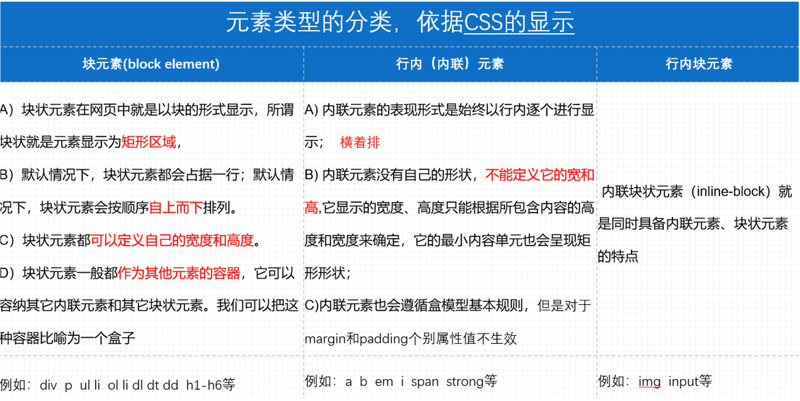
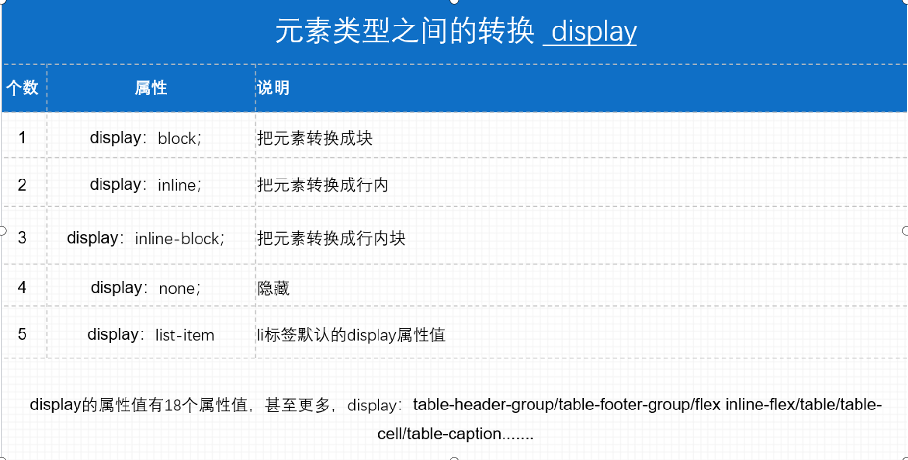
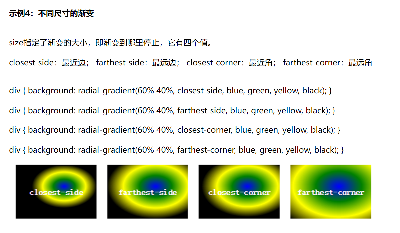

# html&css 笔记

## HTML学习

### 文本标题（h1-h6）

```html
<h1>一级标题</h1>
```

> 注:文本标题标签自带加粗，有自己的文本大小，并且独占一行，有默认间距

### 段落文本(p)

```html
<p>段落文本内容</p>
```

标识一个段落(段落与段落之间有段间距)

### 换行(br)

```html
<br / >
```

换行是一个空标记(强制换行)

### 水平线

```html
<hr />空标记
```

### 加粗有两个标记(推荐strong)

```html
<b>加粗内容</b>只是显示加粗
<strong>强调的内容</strong>突出的文本
```

### 倾斜有两个标记(推荐em)

```html
<em>强调文本</em>
<i>倾斜文本</i>
```

### 删除线有两个标记(推荐del)

```html
<s>文本</s>删除线
<del>文本</del>删除线
```

### 扩展

```html
<u>文本</u>下划线
<sub> </sub>下标
<sup></sup>上标
```

### `<常规标记>`也叫双标记

```html
<标记></标记>
<标记属性=“属性值”属性=“属性值”></标记>
```

标记也可叫标签或叫元素

例如: `<head> </head>`

### 空标记也叫单标记`<标记/>`

`<标记属性=“属性值”/>`，例如:`<br />`

### hr标签

```html
<hr color= " red" width="300px"  align="right">
color=====颜色
width=====宽度
align=====对其方式 (默认为居中，这里可填left或right)
noshade===取消阴影
```

### 特殊符号

<>： `&lt;`左尖角号`&gt;`右尖角号

空格：

`&nbsp;`该空格占据宽度受字体影响明显而强烈

`&emsp;`占据的宽度正好是1个中文宽度,且基本上不受字体影响(一半使用这个)

版权：

`&copy;`©

商标:

`&trade; `™

`&reg;` ®

表情:

`&#128512`

### div标签

没有具体含义，用来划分页面的区域，独占一行。

### span标签

没有实际意义，主要应用在对于文本独立修饰的时候，内容有多宽就占用多宽的空间距离。

### 列表

**有序列表**

```html
<ol>
<li> abc </li>                    //ol中间只能放li,数字是自动生成的，但li中可放置任意标签
</ol>                    
ol的属性：type = 1   a  A   i  I               //可更换排序方法，i,I分别为大小写罗马数字
         start = 数字                        //可指定从哪个数字或字母开始排序
<ol type = "1" start = "3">                   //按照3.4.5.。。。。排序
```

**无序列表**

```html
<!--
1.ol中间只能放li,数字是自动生成的，但li中可放置任意标签
2.默认是实心圆点
3.type = disc,circle,square,none(用的最多)
-->
<ul>
<li>  abc </li>
</ul>
```

**自定义列表**

```html
<dl>
  
<dt>
 可以是文字也可以图
</dt>
   
<dd>
相关文字
</dd>

</dl>
```

### 图片

```html
<!--
    1.code.gif
    2. ./code.gif      //1.2均表示从当前目录下的图片
    3. ./img/1.png     //img文件夹与html文件同级
    4. ../code.gif     //返回上一级文件夹再寻找图片 ..同linux为上一级的意思
-->


图片的标签属性

 ```

 **路径分类：绝对路径、相对路径**

 1、绝对路径

绝对路径是指文件在硬盘上真正存在的路径。例如“bg.jpg”这个图片是存放在硬盘的“E:\book\网页布局代码\第2章”目录下，那么 “bg.jpg”这个图片的绝对路径就是“E:\book\网页布\代码\第2章\bg.jpg"。

注意：绝对路径在实际的开发过程中很少去使用，如果使用“E:\book\网页布\代码\第2章\bg.jpg”来指定背景图片的位置，在自己的计算机上 浏览可能会一切正常，但是上传到Web服务器上浏览就很有可能不会显示图片了，绝对路径可以使用“\”或“/”字符作为目录的分隔字符

2、相对路径(常用)

相对路径，就是相对于自己的目标文件位置。

1)当当前文件与目标文件在同一目录下，直接书写目标文件的文件名+扩展名；
``

2)当当前文件与目标文件所处的文件夹在同一目录下，写法如下：
文件夹名/目标文件全称+扩展名；  ``

3)当当前文件所处的文件夹和目标文件在同一目录下，写法如下：
../目标文件文件名+扩展名；``

### 超链接标签

```html
<a  href=“路径”  title=“鼠标悬停上去之后的提示信息”  target=“规定在何处打开文档">内容</a>
```

Target属性：规定在何处打开文档。

target=“_self“  默认值

target=“_blank“  新窗口打开

### 表格

```html
<table>
    <tr>
        <td>1</td>
        <td>2</td>
    </tr>
    <tr>
        <td>3</td>
        <td>4</td>
    </tr>
</table>
```

#### table单元格的属性

```html
宽度  width                                //可取像素值或百分比（相对于父元素）
高度  height                               //可取像素值或百分比（相对于父元素）
边框  border
边框颜色  bordercolor
背景颜色   bgcolor   
水平对齐  align=“left或right或center”

cellspacing="单元格与单元格之间的间距“

cellpadding="单元格与内容之间的空隙" 
```

#### tr行属性

```html
属性
高度  height

背景颜色   bgcolor   
文字水平对齐  align=“left或right或center”
文字垂直对齐  valign=“top或middle或bottom"
```

#### 单元格td属性

```html
宽度  width                    //改变一整列
高度  height                    //改变一整行
背景颜色   bgcolor   
文字水平对齐  align=“left或right或center”
文字垂直对齐  valign=“top或middle或bottom";
```

#### 单元格的合并

 ```html
Colspan=“所要合并的单元格的列数” 必须给td。
Rowspan=“所要合并的单元格的行数” 必须给td。
```

### 表单

```html
<form method=“get或者post” action=“向何处发送表单数据”>
<input />
属性   type 定义输入框的类型
文本框  type="text“       
密码框  type=“password“

提交框  type=“ submit“  和 <button>提交按钮</button>  一样
按钮框  type=“button“  单纯的按钮
重置框  type=“reset”清空的效果
属性   placeholder  描述输入字段预期值的简短的提示信息。兼容到IE8以上

属性   name 必须设置，否则在提交表单时，用户在其中输入的数据不会被发送给服务器

属性   value             按钮名称
<form/>
```

#### Form当中method的post和get的区别？

1. get是从服务器上获取数据，post是向服务器传送数据。

2. get是把参数数据队列加到提交表单的ACTION属性所指的URL中，值和表单内各个字段一一对应，在URL中可以看到。post是通过HTTP post机制，将表单内各个字段与其内容放置在HTML HEADER内一起传送到ACTION属性所指的URL地址。用户看不到这个过程。

3. 对于get方式，服务器端用Request.QueryString获取变量的值，对于post方式，服务器端用Request.Form获取提交的数据。

4. get传送的数据量较小，不能大于2KB。post传送的数据量较大，一般被默认为不受限制。但理论上，IIS4
（Internet Information Service 互联网信息服务）中最大量为80KB，IIS5中为100KB

5. get安全性非常低，post安全性较高。但是执行效率却比Post方法好。

## CSS学习

### CSS内部样式

```html
在head标签内书写
<style>
修饰对象（如h1）:{
    属性(如color)="red";
                }
</style>
```

### CSS外部

在外部创建单独css文件eg:index.css
后在head里引入

```html
1.<style>
  @import url(index.css);//引入文件名
</style>

2.<link rel="stylesheet" type="text/css" href="index.css">//兼容性较好
```

> 扩展知识点：link和import之间的区别？
> 
> 差别1：本质的差别：link属于XHTML标签，而@import完全是CSS提供的一种方式。
> 
> 差别2：加载顺序的差别：当一个页面被加载的时候（就是被浏览者浏览的时候），link引用的CSS会同时被加载，而@import引用的CSS会等到页面全部被下载完再被加载。所以有时候浏览@import加载CSS的页面时开始会没有样式（就是闪烁），网速慢的时候还挺明显。
> 
> 差别3：兼容性的差别：@import是CSS2.1提出的，所以老的浏览器不支持，@import只有在IE5以上的才能识别，而link标签无此问题。

### CSS行内

```html
<h1 style="color:red;">标题</h1>
```

**优先级就近原则：!important>行内>内部>外部**

eg: color:red!important;

### 类选择器

```css
<style>
    .aa {
        color: blue;
        background-color: lightpink;
    }

    .bim {
        background-color: aquamarine;
    }

</style>

<div>aaaaa-11111</div>
<div class="bim aa">aaaaa-22222</div>
<div class="bim">aaaaa-33333</div>
<div class="bim">aaaaa-44444</div>
<div>aaaaa-55555</div>
```

类选择器也遵循就近原则:当有标签冲突时，优先选择离下面最近的标签，上面案例选择.bim

#### id选择器

一个div唯一一个id，否则会造成信息丢失

```html
<style>
    #box1:{
        color: red;    
    }
</style>

<div id="box1">11111111</div>
```

#### 通配符选择器

语法:*{属性:属性值;}

说明:通配选择符的写法是“*”，其含义就是所有元素。

```css
*{
    margin:O; 
    padding:0;
}代表清除所有元素的默认边距值和填充值;，几乎只用此功能
```

#### 群组选择器

语法:选择符1，选择符2，选择符3....属性:属性值;}例:

```css
    #top1,#nav1，h1{
    width:960px;
 }
 ```

 说明:当有多个选择符应用相同的声明时，可以将选择符用“，”分隔的方式，合并为一组。margin:0 auto;实现盒子的水平居中

 #### 包含选择器/后代选择器

 语法:选择符1 选择符2{属性:属性值}//此处用空格代替","

说明:含义就是选择符1中包含的所有选择符2;

用法:当我的元素存在父级元素的时候，我要改变自己本身的样式，可以不另加选择符，直接用包含选择器的方式解决。如:结构: 

```html
<ul class="list">
    <li></li>
    <li></li>
    <li></li>
</ul>
样式:.list li{background:red;}
```

#### 伪类选择器

**语法︰**

a:link{属性:属性值;}超链接的初始状态;

a:visited{属性:属性值;}超链接被访问后的状态;

a:hover{属性:属性值;}鼠标悬停，即鼠标划过超链接时的状态;

a:active{属性:属性值;}超链接被激活时的状态，即鼠标按下时超链接的状态;Link--visited--hover--active。

A)当这4个超链接伪类选择符联合使用时，应注意他们的顺序，正常顺序为: a:link,a:visited,a:hover,
a:active,错误的顺序有时会使超链接的样式失效;

B)为了简化代码，可以把伪类选择符中相同的声明提出来放在a选择符中;例如: a(colorred;) athover(color.
green;}表示超链接的初始和访问过后的状态一样，鼠标划过的状态和点击时的状态一样。

```css
<style>
  a:link{
      color: aqua;
  }/*初始*/
  a:visited{
      color: blue;
  }/*访问后*/
  a:hover{
      color: brown;
  }/*悬停*/
  a:active{
      color: cadetblue;
  }/*激活*/
</style>
```

#### 选择器的权重

|个数  | 选择器 |权重，cSs中用四位数字表示权重，权重的表达方式如:0，0，0,|
|---   |----   |----                                                |
|2|Class选择器(类选择器)|0001|
|3| id选择器 |0010|
|4|4包含选择符|为包含选择符的权重之和|
|5|内联样式|1000|
|6|6 !important|10000|

csS选择器解析规则1:相同权重的选择符，样式遵循就近原则:哪个选择符最后定义，就采用哪个选择符样式。

csS选择器解析规则2:相同权重的选择符，样式遵循就近原则:哪个选择符最后定义，就采用哪个选择符样式。

所以元素选择器权重最低

包含选择符：即嵌套中权重较大

###  文本属性

|   |属性 |功能|说明|
|---|---- |---|---|
|1|font-size |字体大小|单位是px，浏览器默认是16px,设计图常用字号是12px|
|2|font-family |字体|当字体是中文字体、英文字体中有空格时，需加双引号；多个字体中间用逗号链接,先解析第1个字体,如果没有解析第2个字体,以此类推|
|3|color |颜色|color:red;  color:#ff0;  color:rgb(255,0,0);  0-255|
|4|font-weight |加粗|加粗font-weight:bolder(更粗的)/bold（加粗）/normal（常规），400正常font-weight:100-900; 100-500不加粗   600-900加粗|
|5|font-style |倾斜|font-style：italic(斜体字)/oblique(倾斜的文字)/normal（常规显示）;|
|6|text-align |文本水平对齐|text-align:left;   水平靠左text-align：right；   水平靠右text-align：center；   水平居中text-align:justify;水平2端对齐，但是只对多行起作用。|
|7|line-height |行高|line-height的数据=height的数据，可以实现单行文本垂直居中|
|8|text-indent |首行缩进|text-indent可以取负值；    text-indent属性只对第一行起作用|
|9|letter-spacing|字间距 |控制文字和文字之间的间距|
|10|text-decoration |文本修饰|text-decoration:none没有/underline下划线/overline上划线/line-through删除线，若要同时使用则要用空格隔开  text-decoration : underline overline line-through；|
|11|font |文字简写|font是font-style font-weight font-size / line-height font-family 的简写。    font:italic  800 30px/80px "宋体"；   顺序不能改变 ,必须同时指定font-size和font-family属性时才起作用|
|12|text-transform |字母大小写|            /*text-transform: capitalize;首字母大写*/           /* text-transform: lowercase;全部小写*/           /* text-transform: uppercase;全部大写*/|

#### 字体粗细

```css
<!--
100  :细体;lighter

400  :正常;normal

700  :粗体;bold

900  :更粗体（主要起强调）;bolder

-->
```

### 列表属性

||属性|描述|说明|
|---|---- |---|---|
|1|list-style-type |定义列表符合样式 |list-style-type:disc(实心圆)/circle(空心圆)/square(实心方块)/none(去掉符号) |
|2|list-style-image |将图片设置为列表符合样式 |list-style-image:url(); |
|3|list-style-position |设置列表项标记的放置位置 |list-style-position：outside；列表的外面 默认值list-style-position：inside；列表的里面 |
|4|list-style |简写(合并写法) |list-style:none; 去除列表符号 |

### 背景属性

||属性|描述|说明|
|---|---- |---|---|
|1|background-color |背景颜色 |background-color：red； | 
|2|background-image |背景图片 |background-image:url(); | 
|3|background-repeat |背景图片的平铺 |background-repeat:no-repeat不平铺/repeat默认平铺/repeat-x  水平平铺/repeat-y 竖直平铺； | 
|4|background-position |背景图片的定位 |background-position：水平位置    垂直位置；可以给负值 | 
|5|background-attachment |背景图片的固定 |background-attachment : scroll (滚动)/ fixed（固定，固定在浏览器窗口里面，固定之后就相对于浏览器窗口了） ; | 
|6|background-size |背景大小 |见代码 | 

```css
background-position: center -20px;//背景图片的定位
/*
1.20px 20px
2.10% 10%
3.left center right
top center bottom
*/

background-size: contain;/*设置背景大小*/
/*
1.400px 400px
2.100% 100%
3.cover:把背景图像扩展至足够哒，以使背景图像完全覆盖背景区域。
也许无法显示在背景定位区域中
4.contain:把图像扩展至最大尺寸，以使其宽度和高度完全适应内容区域。若铺不满、
则留白
*/
```

### 背景复合属性

```css
/*
 1.用空格隔开
 2.顺序可换
 3.可以只取一个值，放在后面能覆盖前面的值
 background-size属性只能单独使用
*/
/*复合写法*/
.box6{
    width: 600px;
    height: 600px;
    background: url("img/0.jpg") no-repeat center fixed yellow;
}
```

### 浮动属性

||属性|描述|说明|
|---|---- |---|---|
|1|float |float：left； |元素靠左边浮动 |
|2|float |float：right； |元素靠右边浮动 |
|3|float |float：none； |元素不浮动 |

|浮动的作用1： |定义网页中其它文本如何环绕该元素显示 |
|--|---|
|浮动的作用2： |就是让竖着的东西横着来 |

 1、浮动会脱离网页文档，与其他不浮动的元素发生重叠
      
 2、但是不会与文字发生重叠，文字会环绕浮动元素显示

||属性|描述|说明|
|---|---- |---|---|
|1|clear |Clear：none； |允许有浮动对象 | 
|2|clear |Clear：right； |不允许右边有浮动对象 | 
|3|clear |Clear：left； |不允许左边有浮动对象 | 
|4|clear |Clear:both; |不允许有浮动对象 | 

清除浮动只是改变元素的排列方式，该元素还是漂浮着，不占据文档位置。

### 盒子的边距设计

```css
    padding: 40px 10px 30px 20px;
    /*
    内边距
    1. 1个值，上下左右边距一样
    2. 2个值，上下，左右
    3. 3个值，上 左右 下
    4. 4个值， 上 右 下 左
    */
}
padding属性
/*
1.背景色蔓延到内边距
2.设置单一方向：padding-方向：top bottom left right
*/
padding-top: 10px;
```

### 内边距边框border

```css
复合属性（四条边相同）：border: 10px dotted red;/*边框属性，背景色也能蔓延到边框*/
/*样式：solid实线 double双线 dashed虚线 dotted点状线*/
/*
border包含
border-width
border-style
border-color
*/
/*拆分使用*/可同时改变四个边
border-width: 10px 20px 30px 40px;
border-color: red darkblue darkgoldenrod aquamarine;
border-style: solid dashed double dotted;
```

### 外边距margin

```css
margin: 50px 100px 10px 20px; /*外边距设置，从上开始的顺时针方向记忆*/
/*可以取1-4个值
    1. 1个值，上下左右边距一样
    2. 2个值，上下，左右
    3. 3个值，上 左右 下
    4. 4个值， 上 右 下 左*/
    
    margin-left: -200px; /*单一方向设置，支持负值*/
    margin: 0 auto;屏幕居中，横向居中
```

**特性问题**

1.兄弟关系，两个盒子垂直外边距与水平外边距问题

（1）垂直方向取最大值

（2）水平方向相加

**2.父子关系，给子加外边距，但作用于父身上了，怎么解决？**

```html
/*padding-top: 100px;/*方法1.改变父盒子内边距，但因内边距包含盒子，此时父盒子由原来的长500->600，应再将height减为400*/
/*border: 1px solid transparent;方法2.给父盒子设置边框，减去边框的高度,transparent透明*/
/* margin-top: 100px;*/
/*float: left;方法3.给子盒子或父盒子加float*/
overflow: hidden;/*方法4.bfc*/
```

### PS工具使用

```
ps====图片处理软件(美工来做图, 前端来测量 吸取颜色 切图)

   拿到设计稿之后：使用ps打开
      1、图片上面右键-=====打开方式ps
      2、ps里 文件=>打开
   图片放大和缩小
      ctrl++
      ctrl+-
      alt+滚动
   图片的移动
      按住空格,鼠标变为小手,拖动图片

   如何调整出来标尺
      ctrl+r
      作用：拖动参考线方便测量
      视图里面找到标尺，把对勾勾选上    
   测量图片大小
      使用矩形选框工具（左侧竖着第二个）
      如何查看数据大小（窗口-----信息面板====wh）
      如何修改测量单位：
         在标尺上面右键取修改单位====像素
      ctrl+d===取消选区

      选完后,想调整大小, 可以右键->变换选区

   吸取颜色
      使用吸管工具  I
      吸取颜色完成后，点击左下角的背景色，会右弹窗，在弹窗里面右#十六进制的颜色值可以让你复制

   截图
      1、使用快捷键截图===每次只能截取一个
         使用选框工具框选尼亚截取的区域
            ctrl+c=======ctrl+n=======回车=======ctrl+v=======ctrl+s
                        回车======回车
      2、切片工具 (裁剪工具进行切换)
         使用切片工具框选你要留住的区域，点击文件，存储为web所用格式，弹窗里面点击存储，
         弹窗======格式:仅限图像，切片:所有用户切片
```

#### 解决文字段落与图片空隙

```css
img {
    display: block; /*将img转化为block以匹配p标签的格式，消除图片与文字之间空隙*/
}
```

### 溢出属性（容器的)

```css
overflow:visible/hidden(隐藏)/scroll/auto(自动)/inherit;
visible:默认值，溢出内容会显示在元素之外;
hidden:溢出内容隐藏;
scroll:滚动，溢出内容以滚动方式显示;
auto:如果有溢出会添加滚动条，没有溢出正常显示;
inherit:规定应该遵从父元素继承overflow属性的值。
overflow-x:X轴溢出;
overflow-y:Y轴溢出
```

### 空余空间

```css
white-space: normal/nowrap/pre 预留格式/pre-wrap /pre-line /inherit 该属性用来设置如何处理元素内的空白;
normal:默认值，空白会被浏览器忽略，
nowrap:文本不会换行，文本会在同一行上继续，直到遇到<br/>标签为止;
pre：显示空格 回车，不换行
pre-wrap：显示空格 回车，换行
pre-line：不显示空格 ，显示回车，换行
<pre></pre>                该标签可预留回车空格等格式
```

### 省略号显示

```css
text-overflow:clip/ellipsis ;
clip:默认值，不显示省略号(.…..) ;
ellipsis:显示省略标记;
当单行文本溢出显示省略号需要同时设置以下声明:
1、容器宽度:width: 200px;
2、强制文本在一行内显示:white-space: nowrap;
3、溢出内容为隐藏:overflow: hidden;
4、溢出文本显示省略号:text-overflow: ellipsis;
```

### 定位

| |书写语法 |说明 |文档流 |偏移位置（top  left  right  bottom）时候的参照物 |层叠顺序（z-index）|
|---|---|---|----|---|----|
|1|position：static； |默认值 |默认 |默认 | |
|2|position：absolute； |绝对定位 |脱离 |A）当没有父元素或者父元素没有定位，参照物是浏览器窗口的第一屏   B）有父元素且父元素有定位，父元素 |z-index属性是不带单位的，并且可以给负值，没有设置z-index时，最后写的对象优先显示在上层，设置后，数值越大，层越靠上； |
|3|position：relative； |相对定位 |不脱离 |自己的初始位置 |同上 |
|4|position：fixed |固定定位 |脱离 |浏览器的当前窗口 |同上 |
|5|position: sticky; |粘性定位 |可以做吸顶效果，粘性定位是css3.0新增加的，兼容不好 | | |

**让盒子处于中心位置的方法**

```css
left: 50%;
/* 左移原来一半 */
margin-left: -30px;
/* 设置为盒子的宽度一半 */
```

#### 层级

```css
z-index: -1;/*层级，谁的数值大谁在前*/

有父子盒子时，给子盒子设置负层级可让它在下面
```

### 让行内元素显示为块元素的一些方法

1.display: block;

3.float: left;

2.absolute

### 绘制一个三角形

```css
div{
  width: 0;
  height: 0;
  /*画出三角形写法1
  border-left: 20px solid red;
  border-top: 20px solid rgba(0,0,0,0);/*透明
  border-right: 20px solid rgba(0,0,0,0);
  border-bottom: 20px solid rgba(0,0,0,0);
  */
  写法2
  border: 20px solid transparent;
  border-top: 20px solid red;
}
```

### 定位与浮动区别

```css
float: left;文字环绕效果，半脱离
position: absolute;/*不环绕，被覆盖，全脱离*/
```

### 元素显示类型



<span>标签只可设置左右边距，不可设置上下边距



### 精灵图/雪碧图

一、将导航背景图片，按钮背景图片等有规则的合并成一张背景图，即将多张图片合为一张整图，然后用background-position”来实现背景图片的定位技术。

二、图片整合的优势:

1)通过图片整合来减少对服务器的请求次数，从而提高面的加载速度。

2)通过整合图片来减小图片的体积。

### 宽高自适应

```css
width: auto;/*宽度不设置或设置为auto时为宽度自适应*/
设置为100%时不是自适应，当加入内边距时会撑开滚动条
```

### 浮动元素的高度自适应

父元素不写高度时，子元素写了浮动后，父元素会发生高度塌陷

方法1:给父元素添加声明overflow:hidden;(缺点:会隐藏溢出的元素)

方法2:在浮动元素下方添加空块元素,并给该元素添加声明: clear:both;height:O;overflow:hidden;(缺点:在结构里增加了空的标签，不利于代码可读性，且降低了浏览器的性能)

方法3:万能清除浮动法

```css
.box::after {
    content: "ddddd";
    clear: both;
    display: block;
    height: 0;
    width: 0;
    visibility: hidden;/*让里面的文字不显示*/
}
```

```css
width: calc(100% - 200px);/*该函数运算符可为“+ - * / ” ,但运算符两端必须有空格*/
使用该函数裁剪出合适的大小后可和其他块一起通过浮动来调整位置
```

### 多栏布局写法

```css
//让页面能显示100%的高度
html,body{
  height: 100%;
}
```
### 选择框

#### 单选框

```html
 <input type="radio" name="aaa" id="yiban">     
 <label for="yiban">一般</label>    
 type="radio"为单选框
 name="aaa" 为同一组
<!--有label标签点击文字可选-->
```

#### 复选框

```html
  </div>
  <div>你擅长的技术：</div>
  <div>
    <input type="checkbox"  name="bbb" id="html">
    <label for="html">html</label>
    <input type="checkbox" name="bbb" id="css">
    <label for="css">css</label>
    <input type="checkbox" name="bbb" id="js">
    <label for="js">js</label>
  </div>
</div>
```

### 上传文件

```html
<input type="file" name="" id="">
```

### 隐藏按钮

```html
<input type="hidden" name=""  value="带给后端的个人信息">
```

### 禁用，只读

```html
<button disabled>注册</button>
<input type="text" disabled value="111111">
disabled 禁用
<input type="text" readonly value="111111">
readonly 只读
```

### 图片按钮-代替提交按钮

```html
<form action="">
  <!--上传文件-->
  <input type="image" src="submit.jpg">
</form>
```

### 下拉菜单

```html
<!-- select 支持的属性
  1. size ,显示几个
  2.multiple,支持多选
-->
<!-- option的属性
  1. value ，提供给后端需要用的value值
  2. selected ，默认选中
--><label>
  <select size="3" multiple>
    <option value="ln">辽宁</option>
    <option value="sd">山东</option>
    <option selected>陕西</option>
    <option>河南</option>
    <option>河北</option>

  </select>
</label>
```

### 多行文本输入框-文本域

```html
<!--
    placeholder:提示文字
    默认value: 写在双标签内部，注意不要随便写空格和换行
-->
<label>
  <textarea placeholder="请输入你的意见">提前设置好的value</textarea>
</label>
```

### 表单

```html
<fieldset>
  <legend>性别</legend>
  <input type="radio" name="aa">男
  <br>
  <input type="radio" name="aa">女
</fieldset>
```

### HTML5语法

#### 内容类型(ContentType)

HTML5的文件扩展符与内容类型保持不变，仍然为".html"或".htm"。

#### DOCTYPE声明

不区分大小写

#### 指定字符集编码

meta charset="UTF-8"

#### 可省略标记的元素

不允许写结束标记的元素: br、col、embed、hr、img、input、. link、meta

可以省略结束标记的元素: li、 dt、dd、p. option、colgroup、thead、tbody、tfoot、tr、td、 th

可以省略全部标记的元素: html、head、body、colgroup、tbody

#### 省略引号

属性值可以使用双引号，也可以使用单引号。

#### HTML5新增语义化标签

section元素表示页面中的一个内容区块

article元素表示一块与上下文无关的独立的内容

aside元素在article之外的，与article内容相关的辅助信息

header元素表示页面中一个内容区块或整个页面的标题

footer元素表示页面中一个内容区块或整个页面的脚注

nav元素表示页面中导航链接部分

figure元素表示一段独立的流内容，使用figcaption元素为其添加标题(第一个或最后一个子元素的位置)main元素表示页面中的主要的内容(ie不兼容)

### 音频

```html
<audio src="jiejie.wav" controls loop autoplay muted></audio>
<!-- controls ：控制栏
    loop:循环
    autoplay:自动播放
    muted：静音播放
 -->
 ```

 ### 视频

 ```html
<video src="movie.mp4" controls loop muted poster="poster.jpg" autoplay width="300px" height="100px"></video>
<!-- controls ：控制栏
    loop:循环
    autoplay:自动播放
    muted：静音播放
    poster:海报
    width，height：设置宽高
 -->
 ```

### 数据列表

```html
<input type="text" list="mylist">
<!-- 关联列表，支持查询 -->
<datalist id="mylist">
    <option value="手机"></option>
    <option value="手表"></option>
    <option value="手环"></option>
    <option value="手镯"></option>
</datalist>
```

### 增强表单属性

```html
颜色选择：<input type="color" name="color">
用户名：<input type="text" autofocus pattern="[0-9][A-Z]{3}">
邮箱：<input type="email" multiple autofocus>
<!-- required：必填项，不能为空
      multiple:可填多个地址，用“，”隔开
      autofocus：图标焦点，一个页面只能有一个
      pattern:设置输入密码格式，如此时设为一个数字+三个大写字母
-->
url地址（完整地址）：<input type="url">
电话号码：<input type="tel">
<!-- 手机端使用 -->
滑块效果：<input type="range" name="range" min="100" max="200" value="200" step="10">
<!--
    min,max可设置区间
    step:步长
    value：设置初值
 -->
 数字类型：<input type="number" max="10" name="number">
 <!--
    保证输入为数字
    min,max可设置区间
    step:步长
    value：设置初值
-->
搜索：<input type="search">
日期选择：<input type="date"> 、
月份选择：<input type="month">
周数选择：<input type="week">  
精确时间： <input type="datetime-local">
```

### CSS3的概念和优势

.css3是ccs技术的开级敌本，css3语言开发是朝着模块比发展的。以前的规范作为一个横块实在是太庞大而且比较复杂，所以，把它分解为一些小的摸块，更多新的模块也被加入进来。这些模块包括:盒子模型、列表模块、超链接方式、语言模块、背景和边框、文字特效、多栏布局等。

.css3的优点:.css3将完全向后兼容，所以没有必要修改现在的设计来让它们继续运作，风络就览器也还将继续支特CSS2。，对我们来说，css3主要的影响是将可以使用新的可用的进择绷和羁住，这些会允许实现的.css3的优点:css3将完全向后兼容，所以没有必要修改现在的设计来让它们继续运作，风络就览器也还将继续支特CSS2。，对我们来说，css3主要的影响是将可以使用新的可用的进择绷和羁住，这些会允许实现的设计效果（譬如动态和渐变)，而且可以很简单的设计出现在的设计效果（比如说使用分栏)

### 渐进增强和优雅降级

渐进增强 progressive enhancement:

针对低版本浏览器进行构建页面，保证最基本的功能，然后再针对高级浏览器进行效果、交互等改进和追加功能达到更好的用户体验。

优雅降级graceful degradation:

—开始就构建完整的功能，然后再针对低版本浏览器进行兼容。

区别:

优雅降级是从复杂的现状开始，并试图减少用户体验的供给，而渐进增强则是从一个非常基础的，能够起作用的版本开始，并不断扩充，以适应未来环境的需要。降段(北能哀威)意味着(往值看，而轮进增强意味着朝前看，同时保证其根基处于安全地带。

### 层级选择器

```css
 +选择这个节点的后面第一个兄弟 
.child + li{
    background: #219cea;
}
 ~选择这个节点的后面所有兄弟 
.child ~ li{
    background: #219cea;
}
```

### 属性选择器

```css
/* =完全匹配，只有只含box1的被选中 */
div[class=box1] {
    background: lightskyblue;
}
/* ~=包含就匹配 */
div[class*="1"],p[class*="1"]{
    color: green;
}
/*  模糊匹配
    class^=b 以这个开头的
    class$=b 以这个结尾的
    class*=b 包含这个字符
*/
div[class^=b]{
    border: 3px solid blue;
}
/属性选择/
input[type=email] {
    background: #0c008b;
}
```

### 伪类选择器

#### 结构性伪类选择器

X:first-child 匹配子集的第一个元素。IE7就可以支持

X:last-child匹配父元素中最后一个X元素

X:nth-child(n)用于匹配索引值为n的子元素。索引值从1开始

X:only-child这个伪类一般用的比较少，比如上述代码匹配的是div下的有且仅有一个的p，也就是说，如果div内有多个p，将不匹配。

X:root匹配文档的根元素。在HTML（标准通用标记语言下的一个应用)中，根元素永远是HTML

X:empty匹配没有任何子元素（包括包含文本)的元素X

#### 目标伪类选择器

E:target选择匹配E的所有元素，且匹配元素被相关URL指向

#### U元素状态伪类选择器

E:enabled 匹配所有用户界面(form表单）中处于可用状态的E元素

E:disabled 匹配所有用户界面(form表单）中处于不可用状态的E元素

E:checked 匹配所有用户界面(form表单）中处于选中状态的元素E

E::selection 匹配E元素中被用户选中或处于高亮状态的部分

#### 否定伪类选择器

E:not(s)(IE6-8浏览器不支持:not()选择器。)匹配所有不匹配简单选择符s的元素E
#### 动态伪类选择器

E:link
链接伪类选择器
选择匹配的E元素，而且匹配元素被定义了超链接并未被访问过。常用于链接描点上

E:visited
链接伪类选择器
选择匹配的E元素，而且匹配元素被定义了超链接并已被访问过。常用于链接描点上

E:active
用户行为选择器
选择匹配的E元素，且匹配元素被激活。常用于链接描点和按钮上

E:hover
用户行为选择器
选择匹配的E元素，且用户鼠标停留在元素E上。IE6及以下浏览器仅支持a:hover

### 伪元素

```css
/*伪元素*/
div::first-letter {
    font-size: 30px;
    color: red;
}
div::first-line{
    color: yellowgreen;
}
div::before{
    content: "aaaaa";
}
div::after{
    content: "bbbbbb";
}
```

### 文本阴影

```css
div{
  text-shadow: 10 10px 1px red, 0 -10px 1px yellow;
}
/* 10px 水平方向位移，向右
    10px 垂直方向位移，向下
    1px 模糊程度，越大越模糊
    支持多个阴影
 */
 ```

 ### 盒子阴影

 ```css
 /*box-shadow: 10px 10px 10px #ed164b, -10px -10px 10px 200px red;*/
/* 200px 设置阴影的大小
 ,inset设置内阴影*/
 ```

 ### 字体引入

 ```css
@font-face {
  font-family: miaomiao;
  /* 给自己的字体起名 */
    src: url("font/ygyxsziti2.0.ttf");
    [font-weight: <weight>];
    [font-style: <style>];//设置是否倾斜。。。
}
div{
    font-family: miaomiao,serif;
    font-size: 50px;
    color: red;
    text-shadow: 5px 0 0 green;
}
```

### 怪异盒模型

```css
box-sizing: border-box;
/* 怪异盒模型，里面的内容大小永远不超过盒子 */
```

### 弹性盒

```css
1.display: flex;
/*  弹性盒设置方式，
影响：
    1.会让子元素默认横向排列
    2.让原来的行内元素变成块级元素
    3.只有一个元素的时候，margin: auto自动居中
*/
2.   flex-direction: column-reverse;
/*  弹性盒主轴方向
    row,水平排列
    column，竖直排列
    row-reverse,水平方向反向
    column-reverse,竖直方向反向
  */
3.  justify-content: space-around;
/* 调整主轴对齐方向         
    flex-start，向左对齐
    flex-end，向右对齐
    center,中间对齐
    space-between,两端对齐
    space-around，距离环绕`
*/
4.    align-items: center;
/*  调整侧轴方向
    flex-end
    flex-start
    center
*/
5.flex-wrap: wrap;
/*  折行  */

6.align-content: space-around;
/*  控制折行后的行间距
  flex-start，紧密排列，整体向前移
  flex-end，紧密排列，整体向后移
  space-between
  space-around
  */
```
### 移动端布局

```html
<!--
    模拟器上显示分辨率
    css像素： 设备的独立像素
    物理分辨率： 设备像素

    设备像素比（dpr）=物理像素/CSS像素
    适配不同分辨率的手机

    iphone6 1css 像素===2物理像素


    设计稿：
    1.css像素375，物理像素750（为了清晰的页面）
    2.1份（提供），多份？
    尽量使用百分比，弹性盒布局，rem布局
-->
设计移动端必不可少的一句话
<meta name="viewport" content="width=device-width, initial-scale=1.0">
<!--  user-scalable=no,用户不能缩放
        content="width=device-width，理想宽度等于设备宽度
        initial-scale=1.0，1不缩放
  -->
```

### 横向滚动条

```css
    flex-shrink: 0;
/*  横向滚动条设置  */
仍可使用
overflow: auto;
```

### 多列布局

```css
/*  显示的列数*/
column-count: 5;
/* 调整列间距 */
  column-gap: 30px;
  /* 列边框 */
  column-rule: 2px solid red;
  /* 列高度统一 */
  column-fill: auto;
/* auto把父盒子占满，不再考虑分成多少列 */
/* 调整列宽 */
  column-width: 500px;
 在子盒子中设置
   div>h1{
  column-span: all;}
  /* 横跨几列 */
      break-inside: avoid;
/*  禁止盒子内部折行显示  */
```

### 响应式布局

```css
通过获取屏幕宽度来改变显示内容
@media screen and (max-width: 1000px) and (min-width: 500px){
  body{
    background: red;
  }
}

/* 竖屏*/
@media screen and (orientation: portrait) {
    div {
        width: 33.333%;
    }
}
/* 横屏 */
@media screen and (orientation: landscape) {
    div {
        width: 20%;
    }
}
```

### 单位转换

```css
/*
  100vh === 视口的高度
  vh view-height
  100 vw === 视口宽度
  vw view-width
  */
/*
 没有滚动条的时候，
 100vw === 100%
 有滚动条的时候
 100vm 包含滚动条，窗口的大小
 100% 刨除滚动条 剩余的大小
 */
 ```

### 渐变

```css
 1.线性渐变
   background: linear-gradient(0deg, red,green,yellow);
/* 渐变属性，支持n个值
 默认为 to bottom 为从上到下,修改可改变其方向值to left top
 */
 2.径向渐变
 background: radial-gradient(red 0%,green 10%,blue 30%);
 // 设置百分比表示到百分之几为该颜色
   background: radial-gradient(circle,red ,green,blue);
/* circle,使涟漪变成一个圆 */
  background: -webkit-radial-gradient(60% 40%,farthest-corner,blue,green,yellow,black)
/* 设置中心位置，虽然这里报错但还是有用 */

重复渐变
  background: repeating-radial-gradient(red,yellow 10%,green 20%);
/* repeating-linear-gradient 直
 repeating-radial-gradient  圆
 */
 ```



### 过渡

```css
transition: all 2s linear 2s;
/*
  all 所有属性
  2s 动画持续时间
  linear 匀速
  2s 延迟

  除了 display: none/block 属性
  */
  
  ease-in-out/* 先加速后减速 */
  ease-out /* 减速 */
  ease-in /* 加速 */
  ease /* 逐渐减速 */
  linear /* 默认匀速 */
  属性
  cubic-bezier(.33,1.2,.83,.67)
  https://cubic-bezier.com/
  ```

### 2d-平移

```css
  transform: translateY(100px) translateX(100px);
  transform: translate(100px,20px);
/* 上面的写法可简化为下面的写法 */
/*
 translateX 正值向右，负值向左
 translateY 正值向下，负值向上
 两个属性可同时使用
 */
 ```

### position与transform属性

设置left属性会频繁的造成浏览器回流重排，而transform和opacity属性不会，因为它是作为合成图层发送到GPU上，由显卡执行的渲染，这样做的优化如下。可以通过亚像素精度得到一个运行在特殊优化过的单位图形任务上的平滑动画,并且运行非常快。动画不再绑定到CPU重排，而是通过GPU合成图像。即使运行一个非常复杂的JavaScript任务，动画仍然会很快运行。

### scale

```css
transform: scale(-1.5);
/*
    性能较好，从中心放大
    设置缩放的倍数
  若设置为负值则倒向
  支持x轴，y轴单独放大的效果
  scaleX
  scaleY

  */
  
  transform: rotate(10deg);
/*
正值为顺时针方向
负值为逆时针方向
 */
 transform,可支持多个属性，但要注意使用的先后顺序
 transform-origin: left top;
 /*  改变旋转中心位置，绕左上角旋转  */
/*
正值为顺时针方向
负值为逆时针方向

绕X轴或Y轴

rotateZ === rotate 中心
 */
 ```

### 倾斜

```css
transform: skew(30deg,30deg);
/*  skewX原来正的正方形拽着右下角向右拖动了30度
      -30deg原来正的正方形拽着左下角向左拖动了-30度
      skewY原来正的正方形拽着右下角向下拖动了30度
      -30deg原来正的正方形拽着左下角向下拖动了-30度
      skew 正值，拽右下角，向右下边拉动，形成30deg
  */
```

### 关键帧动画animation

```css
    animation: identifier1 1s linear ;
/*  关键帧属性
  infinite 无限次执行,默认只执行一次，当然也可通过数字直接设置动画次数
  */
}
/* 声明一个动画 */
@keyframes identifier1 {
    from{
        width: 200px;
        height: 200px;
        background: red;
    }

    to{
        width: 400px;
        height: 400px;
        background: plum;
    }
}
@keyframes identifier2 {
0%{
    width: 200px;
    height: 200px;
    background: red;
}
25%{
    width: 200px;
    height: 400px;
    background: yellow;
}
50%{
    width: 400px;
    height: 200px;
    background: green;
}
75%{
    width: 200px;
    height: 400px;
    background: purple;
}
100%{
    width: 400px;
    height: 400px;
    background: plum;
}
}
```

#### animation的一些属性

```css
div{
      transform: translateX(-100%);
    /* 100%是相对于盒子自身的100% */
      animation: run 1s linear forwards reverse;
      /*animation-fill-mode: forwards;*/
    /*
        保留动画最后状态的属性
        none 初始默认
        forwards 保留动画最后一帧
        backwards 保留动画第一帧
     */
     }
 ```

#### animation单一属性

```css
div{
      animation-name: identifier2;
      animation-duration: 10s;
      animation-timing-function: linear;
      animation-delay: 0s;
      animation-iteration-count: infinite;
      animation-play-state: running;
    /* 运动或暂停，配合hover使用 */
      animation-direction: alternate-reverse;
    /*
     动画运行方向：
     reverse 反方向
     normal 正常方向
     alternate 由正常方向开始两个方向交替进行
     alternate-reverse 由反方向开始两个方向交替进行
     */
    }
    div:hover{
      animation-play-state: paused;
    }
```

#### animation案例记录

1、 轮播图

为了实现无缝隙轮播，第一份图片和最后一份是一样的 

2、 逐帧动画

```css
div{
animation: run 5s steps(100,start);}
/*  end 保留当前帧，看不到最后一帧，动画结束
    start  保留下一帧，看不到第一帧，从第一镇很快跳到最后一帧
*/
```

>注：由于几乎看不到最后一帧，故将最后一帧设为空白，以实现无缝衔接和动画流畅

3、引用css动画效果网站

```html
 <link rel="stylesheet" href="https://cdnjs.cloudflare.com/ajax/libs/animate.css/3.5.1/animate.min.css">
 ```

>附：原网站网址：https://animate.style/

### 3d

搭建3d舞台
```css
transform-style: preserve-3d;
    /*
        flat: 2d舞台
        preserve-3d：3d舞台 */
perspective: 900px;
/* 设置景深，即眼睛与屏幕的距离，不设置看不出近大远小 */

```

#### 3d-平移

```css
transform: translateZ(100px);
transform: translateX(100px);
transform: translateY(100px);
transform: translate3d(0,0,200px);
/* 分别对应x,y,z */
/* 正值近，负值远 */
```

#### 3d-旋转

```css
transform: rotateX(30deg);
transform: rotateY(30deg);
transform: rotateZ(30deg);
transform: rotate3d(1,1,1,30deg);
/*  x,y,z转30deg,前面的数字表示倍数  */
```


