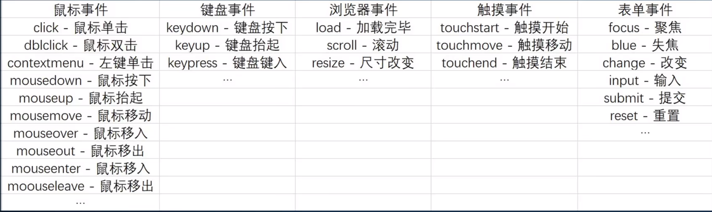
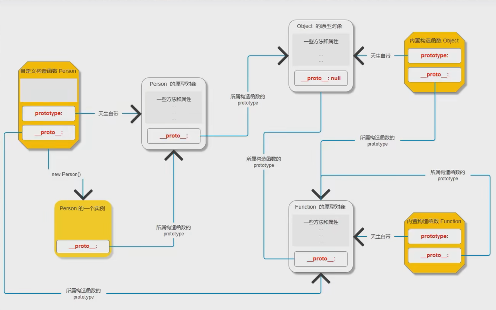

## JS

空类型：Undefined Null
使用typeof关键字来进行数据类型检测
语法:typeof 要检测的变量
结果:该变量存储的数据的数据类型

### 转数值

1.Number();

语法:Number(要转换的内容)

结果:转换好数值类型的结果

2.parseInt();

语法:parseInt(要转换的内容)

结果:转换好数值类型的结果

3.parseFloat();

语法:parseFloat(要转换的内容)

结果:转换好数值类型的结果

两者的区别：Number只要有不是数字的就出现NaN，parseInt会把前面的数字转化出来，只有当第一位就不是数字
时才转化为NaN,parseFloat与parseInt一致，但parseFloat可以显示小数

### 转字符串

1.String();

语法:String(要转换的内容)

结果:转换好字符串类型的结果

2. toString();

语法:要转换的内容.toString()

结果:转换好字符串类型的结果
### 转布尔

1.Boolean();

语法:要转换的内容.Boolean()

结果:转换好布尔类型的结果

>注释：false:  0 NaN '' undefined null
其他都转换为true
### 赋值运算符

= ：进行值操作

+= ：加等于运算符

-=  ：减等于运算符

*= ：乘等于运算符

/= ：除等于运算符

%= ：取余等于运算符

### 比较运算符

>︰大于比较

< ：小于比较

>= ：大于等于

<= ：小于等于

== ：等于

**== ： 只比较值是否相等，不考虑数据类型**

=== ：全等于

**=== ： 值和数据类型都相等才等于**

!= ： 不等于比较不考虑数据类型

!== ：不全等于比较考虑数据类型

### 逻辑运算符

与 ：&&

或 ： ||

非 ：！

### 自增自减运算符

++i : 前置++，先自增后运算，参与运算的值为i+1

i++ ：后置++，先运算后++，参与运算的值为i

--i : 前置--，先自减后运算，参与运算的值为i-1

i-- ：后置--，先运算后--，参与运算的值为i
### 函数

```js
function 函数名（）{
    函数内为形参
}
//调用一个函数，添加两个实参，给形参进行赋值
函数名（10，20）
```

### 函数作用域

```js
// 访问：自己有就用自己的，自己没有用父级的，以此类推，到全局都没有就报错
//自己给自己赋值，自己没有给父级的赋值。以此类推，到全局都没有，定义为全局再赋值
```

### 对象

```js
//   创建一个对象
var obj = {
  a: 100,
  b: true,
  c: 'hello world'
}
//  增，向对象内添加一个键值对
obj.name = '小灰狼'
obj['age'] = 18

//  删
delete obj.name
delete obj['age']

//  改
obj.name = '公羊'
obj['age'] = '60'

//  查
console.log(obj.name)
console.log(obj['age'])
```

### 数组

```js
 var arr = [100, 200, 300, 400]
  console.log(arr)
  console.log(arr.length)
  //  修改数组长度
  arr.length = 3
  console.log(arr)
  console.log(arr.length)

//  输出索引为2 的数据
  console.log(arr[2])

//  修改所引的数据
  arr[2] = 3
  console.log(arr[2])
//  数组的遍历
  for (let i = 0; i < arr.length; i ++){
    console.log(arr[i])
  }
```
### 数组常用方法

```js
1.push
 作用：添加新元素至最后
  const res = arr.push('追加的')
  console.log(res)
//  返回值为该数组长度
2.pop()
语法︰数组. pop()
作用︰删除数组最后一个数据
返回值︰被删除的数据
3.unshift()
语法︰数组.unshift(数据)
作用︰将数据添加到数组的最前
返回值︰添加数据后数组最新的长度
4.shift()
语法︰数组.shift()
作用:删除数组最前一个数据
返回值︰被删除的数据
5. reyerse()
语法∶数组.reverse()
作用:将数组反转
返回值︰反转后的数组
6.splice()
语法︰数组.splice(开始索引，多少个，要插入的数据)
开始索引:默认是0
多少个:默认是0
要插入的数据︰默认是没有(从哪删除从哪插入)
作用︰删除数组中若干数据，并选择是否插入新的数据
返回值︰以新数组的形式返回被删除的数据
7. sort()
语法∶
值:排序好的新数组
8. join()
语法∶数组.join(连接符)
作用:将数组用连接符连接成为一个字符串
返回值:连接好的字符串
9.concat()
语法︰数组.concat(其他数组)
作用︰将其他数组和数组拼接在一起
返回值︰拼接好的 新数组
10.slice()
语法︰数组.slice(开始索引，结束索引)
开始索引:默认是0
结束索引︰默认是数组长度
作用︰截取数组中的某些数据
返回值:以新数组的形式返回截取出来的数据
11.indexQf()
语法︰数组.indexOf(数据)
作用:查找数据在数组中的索引位置
返回值:
有该数据，返回第一次出现的索引位置
没有该数据，返回-1
12.forEach()
语法︰数组.forEach( function ( item，index,arr ){})
作用︰遍历数组
返回值︰无
13.map()
语法︰数组.map( function ( item,index,arr ){})
作用:映射数组
返回值︰映射后的新数组
14.filter()
语法︰数组.filter( function ( item，index,arr ) {} )
作用︰过滤数组
返回值∶过滤后的新数组
15.eyery()
语法︰数组.every( function (item,index,arr ) {})
作用︰判断数组是不是每一项都满足条件
返回值:一个布尔值
16.some()
语法︰数组.some( function ( item，index,arr ) {})
作用︰判断数组是不是有某一项满足条件
返回值∶一个布尔值
```

### 字符串常用方法

```js
1.charAt()
语法︰字符串.charAt(索引)作用︰获取对应索引位置的字符
返回值:对应索引位置的字符

2. toLowerCase()
语法∶字符串.toLowerCase()
作用︰将字符串内的字母全部转换成小写
返回值∶转换好的字符串

3. toUppercase()
语法︰字符串.toUpperCase()
作用︰将字符串内的字母全部转换成大写
返回值︰转换好的字符串

4. replace()
语法︰字符串.replace('换下内容'，'换上内容')
作用︰将字符串内第一个满足换下内容的片段替换成换上内容
返回值︰替换好的字符串

5. trim()
语法︰字符串.trim()
作用︰去除字符串收尾的空格
返回值︰去除空格后的字符串

6.split()
语法∶字符串.split(分隔符)
作用︰按照分隔符将字符串切割成为一个数组
返回值︰切割后的数组

7. substr()
语法︰字符串.substr(开始索引,多少个）
8.substring()
语法︰字符串.substring(开始索引,结束索引）
9. slice()
语法︰字符串.slice(开始索引，结束索引）
以上三个
作用︰截取字符串
返回值︰截取出来的字符串
```

### 数字常用方法

```js
1.random()
语法:Math.random()
作用︰获取0 ~1之间的随机小数，
包含0，但是不包含1
返回值:0 ~1之间的随机小数

2 .round()
语法: Math.round(数字)
作用︰对数字进行四舍五入取整
返回值:四舍五入后的整数

3.ceil()
语法: Math.ceil(数字)
作用︰对数字进行向上取整
返回值∶向上取整后的整数
4. floor()
语法: Math.floor(数字)
作用︰对数字进行向下取整
返回值∶向下取整后的整数
5.pow()
语法: Math.pow(底数，指数)
作用︰对数字进行取幂运算
返回值︰取幂后的结果

6.sqrt()
语法: Math.sqrt(数字)
作用:对数字进行二次方根运算
返回值:二次方根后的结果

7.abs()
语法: Math.abs(数字)
作用︰对数字进行绝对值运算
返回值︰绝对值运算后的结果

8.max()
语法: Math.max(数字1，数字2，数字3，... )
作用:获取若干数字的最大值
返回值︰若干个数字中的最大值

9.min()
语法: Math.min(数字1，数字2，数字3，... )
作用:获取若干数字的最小值
返回值︰若干个数字中的最小值

10.PI
语法: Math.PI
作用︰得到一个近似T的值
```

### 时间常用方法

```js
获取当前时间
var time = new Date()
输出一个自设时间
var time = new Date(年,月,日，时，分，秒)

1.时间对象.getFullYear()
获取至时间对象干的年份信息
2．时间对象.getMonth()
获取到时间对象中的月份信息
3．时间对象·getDate()
扶取至时间对象中的曰期信息
4.时间对象·getHours()
获取至到时间对象中的小时信息
5．时间对象.getMinutes()
获取到时间对象中的分钟信息
6．时间对象.getSeconds()
获取到时间对象中的秒钟信息
7.时间对象.getDay()
获取到时间对象中的星期信息
8．时间对象.getTime()
获取到时间对象中的时间戳信息（毫秒）

设置时间信息

1.时间对象.setFullYear()
设置时间对象中的年份信息
2．时间对象.setMonth()
设置时间对象中的月份信息
3．时间对象.setDate()
设置时间对象中的日期信息
4.时间对象.setHours()
设置时间对象中的小时信息
5．时间对象.setMinutes()
设置时间对象中的分钟信息
6．时间对象.setSeconds()
设置时间对象中的秒钟信息
8．时间对象.setTime()
设置时间对象中的时间戳信息
```

### BOM操作

```js
1.获取浏览器窗口尺寸
获取可视窗口宽度: window.innerWidth
获取可视窗口高度: window.innerHeight

2.浏览器的弹出层
提示框:window.alert('提示信息)
询问框: window.confirm('提示信息’)
输入框: window. prompt( '提示信息’)

3.开启和关闭标签页
开启: window.open('地址’)
关闭: window.close()

4、浏览器常见事件
资源加载完毕: window. onload = function (){}
可视尺寸改变: window.onresize = function () {}
滚动条位置改变:window.onscroll = function （{}

5.浏览器的历史记录操作
回退页面: window.history.back()
前进页面: window.history.forward()


6、浏览器卷去的尺寸
卷去的高度∶
document.documentElement.scrollTop
//<!DOCTYPE html>有这个标签时使用1
document.body.scrollTop
可以使用或运算符中和两种写法

卷去的宽度:
document.documentElement.scrollLeft
//<!DOCTYPE html>有这个标签时使用1
document.body.scrollLeft

7、浏览器滚动到
滚动到: window.scrollTo()
参数方式1 : window.scrollTo( left, top )
left :浏览器卷去的宽度
top :浏览器卷去的高度
滚动到: window.scrollTo()
参数方式1 : window.scrollTo(
left, top )
参数方式2 : window.scrollTo(
{
left: XX,
top: yy,
behavior: 'smooth'})
// 方法2应该较为平滑
```

### 定时器

**间隔定时器**

按照指定周期(毫秒)去执行指定的代码

语法:setInterval(函数，时间)

函数︰每次要执行的内容

时间∶单位是毫秒

```js
    setInterval(function (){
      console.log('执行一次')
    },1000)
  //  一千毫秒执行一次
```

**延时定时器**

在固定的时间(毫秒)后指定一次代码

#### 定时器返回值

```js
    const timer1 = setTimeout(function (){},1000)
    const timer2 = setInterval(function (){},1000)

  //  输出返回值
    console.log('timer1: ',timer1)
    console.log('timer2: ',timer2)
```

返回值为1和2，返回值只表示返回第几个定时器，与定时器种类无关

#### 关闭定时器

语法一: clearInterval(要关闭的定时器返回值)

语法二: clearTimeout(要关闭的定时器返回值)

### DOM基本操作

#### 获取元素的方式

**根据id名称获取**

语法: document.getElementById( 'id名称’)

作用:获取文档流中id名对应的一个元素

返回值:如果有id 对应的元素，就是这个元素如果没有id 对应的元素，就是null

```js
<div>一号</div>
<div class="box content">二号</div>
<div class="box" id="container">三号</div>
<script>
  const ele = document.getElementById('container')
  console.log(ele)
</script>
```

**根据元素类名获取**

语法:document.getElementsByClassName( '元素类名’)

作用:获取文档流中所有类名对应的元素

返回值∶必然是一个**伪数组**如果有类名对应的元素，有多少获取多少如果没有类名对应的元素,空的伪数组

**根据元素标签名获取**

语法: document.getElementsByTagName(‘标签名')

作用:获取文档流中所有标签名对应的元素

返回值:必然是一个伪数组如果有标签名对应的元素，有多少获取多少如果没有标签名对应的元素,空的伪数组

**根据选择器获取一个**

语法: document.querySelector(‘选择器’)

作用:获取文档流中满足选择器规则的**第一个**元素

返回值:如果有选择器对应的元素，获取到第一个。如果没有选择器对应的元素，null

**根据选择器获取一组**

语法: document.querySelectorAll('选择器')

作用:获取文档流中所有满足选择器规则的元素

返回值:必然是一个伪数组，如果有选择器对应的元素，有多少获取多少；如果没有选择器对应的元素，空的伪数组

**创建节点**

语法:document.createElement('标签名称’)

作用︰创建一个指定标签元素

返回值∶一个创建好的元素节点

**插入节点**

语法1 :父节点.appendChild(子节点)

作用︰把子节点放在父节点的内部，并且放在最后的位置

语法2 ∶父节点.insertBefore(要插入的子节点，哪一个子节点的前面)

作用∶把子节点放在父节点的内部，并且放在指定某一个子节点的前面

**删除节点**

语法1 :父节点.removeChild(子节点)

作用:从父节点内删除某一个子节点

语法2:节点.remove()

作用：删除这个节点

**替换节点**

语法:父节点.replaceChild(换上节点，换下节点)

作用︰在父节点内，使用换上节点替换掉换下节点

**克隆节点**

语法∶节点.cloneNode(是否克隆后代节点)

作用︰把该节点复制一份一模一样的内容

返回值：克隆好的节点

**获取元素的尺寸**

语法:元素.offsetHeight元素.offsetwidth

获取:元素内容+padding + border 区域的尺寸

语法︰元素.clientHeight------元素.clientwidth

获取︰元素内容+ padding区域的尺寸


#### 操作元素内容

**操作元素文本内容**

获取︰元素.innerText

设置:元素.innerText = '新内容'

**操作元素超文本内容**
 
获取:元素.innerHTML

设置:元素.innerHTML ='新内容'

#### 操作元素属性

**原生属性**

获取:元素,属性名

设置:元素.属性名='属性值'

**自定义属性**

获取:元素.getAttribute('属性名’)

设置:元素.setAttribute('属性名'，'属性值’)

删除∶元素.removeAttribute('属性名')

```js
<button>操作属性</button>
<div id="box" hello="world">div 标签</div>
  const res = box.getAttribute('hello')
    //  获取自定义属性值

    btn.onclick = function (){
    box.setAttribute('hello','新来的')
  //  点击按钮，自定义属性变为新来的
  }

      btn.onclick = function (){
    box.removeAttribute('hello')
  //  点击按钮，自定义属性被删除
  }
  type = allBtn.checked
  获取到布尔类型的返回值
```

#### 操作元素类名

获取︰元素.className

设置︰元素.className = '新类名'

```js
<div class="content">div 标签</div>
 box.className = 'box'
 ```
 
 #### 操作元素行内样式

获取︰元素.style.样式名

设置︰元素.style.样式名='样式值'

```js
background-color ---backgroundColor
  console.log(box.style.backgroundColor)
//  在js中获取一些带中划线的属性时，需要改成驼峰命名法
```

#### 获取元素非行内样式

获取: window.getComputedStyle(元素).样式名

注意︰可以获取行内样式，也可以获取非行内样式

### 事件绑定

**事件绑定的三要素**

1.事件源:和谁做好约定

2.事件类型:约定一个什么行为

3.事件处理函数:当用户触发该行为的时候，执行什么代码

语法:

事件源.on事件类型=事件处理函数

#### 事件类型



#### 事件对象

当事件触发的时候，一个描述该事件信息的对象数据类型

#### 事件对象内的信息-鼠标事件

**坐标信息**

1. offsetX和 offsetY
相对于触发事件的元素

2. client 和 clientY相对于浏览器可视窗口


3. pageX 和 pageY相对于页面文档流

#### 事件对象内的信息一键盘事件

键盘编码--事件对象.keyCode

#### 事件传播

浏览器响应事件的机制

浏览器窗口最先知道事件的发生

**捕获阶段**:从 window按照结构子级的顺序传递到目标

**目标阶段**:准确触发事件的元素接收到行为

**冒泡阶段**:从目标按照结构父级的顺序传递到 window 本次事件传播结束

#### 阻止事件传播

语法:事件对象.stopPropagation()

#### 事件委托

利用事件冒泡的机制，把自己的事件委托给结构父级中的某一层

```js
e.target.tagName
target：点击的目标
tagName：准确点击的元素
```

### 面向对象

**了解面向对象**

面向对象是我们的一种开发方式

面向过程:一种关注过程的开发方式

在开发过程中,我们要关注每一个细节，步骤，顺序+面向对象:一种面向对象的开发方式

在开发过程中,我们看看有没有一个对象能帮我们完成任务

**开发过程中的例子:选项卡**

面向过程：

=>考虑获取那些元素

=>考虑给那些元素绑定点击事件=>考虑点击的时候，做什么

+面向对象：

=>考虑有没有一个对象能帮我们完成选项卡=>如果有,那么我就直接让这个对象帮我完成

=>如果没有,我们就需要制造一个这样的对象来帮我完成

+我们需要一个"机器"

=>这个机器能给我生产一个对象

=>生产出来的对象能完成选项卡功能

=〉我们只要准备好这个机器就可以了

=〉本次开发过程中，我们制造机器，制造好以后，用机器生成一个对象完成选项卡

=〉当你第二次想进行选项卡开发的时候，那么我们不需要再次制造机器了

=>只要用原先准备好的机器，再次制造一个新的选项卡对象

+我们制造“机器"得过程,就是面向对象封装的过程

=>面向对象的核心:高内聚低耦合(就是对面向过程的高度封装)

#### 核心

```js
核心:

+找到一个机器,能批量生产对象

+生产出来的对象,每一个对象都有自己的属性和方法

+每一个对象可能类似,但是内容不太一样

=>构造函数

=>可以批量生产对象

=>可以向函数一样传递参数，可以给每一个对象添加一些不同的内容

=>当你需要完成一个功能的时候,我们先制造一个构造函数

-> 利用构造函数去创建一个可以完成任务的对象

->依赖这个对象完成功能

+这个“机器”(构造函数)要生产有属性有方法的合理的对象

=>机器: 就是构造函数
=>属性:直接写在构造函数体内
  方法:写在构造函数的原型上
```


```js
<!-- 创建对象的方式
    1。字面量方式创建对象
    var obj = {i ..。}可以后期动态添加

    2.内置构造函数创建对象
    +var obj = new Object()+可以后期动态添加

    1.2方法均不好批量创建

    3。工厂函数创建对象

    3-1。制造一个工厂函数
    3-2。使用工厂函数去创建对象

    4。自定义构造函数创建对象
    4-1。制造一个自定义构造函数
    4-2。使用自定义构造函数去创建对象

<!-- 1。字面量方式创建对象 -->
    const obj = {
        name: 'Jack',
        age: 18,
        sayHi: function () {
            console.log('Hello world')
        }
    }
    //如果我想创建第二个对象
    const obj2 = {
        name: 'Rose',
        age: 20,
        sayHi: function () {
            console.log('Hello world')
        }
    }

    //2.内置构造函数创建对象
const obj = new Object()
obj.name = 'Jack'
obj.age = 18
obj.sayHi = function (){  console.log('hello world')  }

// 3。工厂函数创建对象
function createObj(name,age){
    const obj ={}
//    手动向里面添加属性
    obj.name = name
    obj.age = age
    obj.sayHi = function (){  console.log('Hello world')  }
    return obj
}

//  使用工厂函数去创建对象
const obj1 = createObj('Jack',18)
const obj2 = createObj('Rose',20)
console.log(obj1,obj2)

// 4。自定义构造函数创建对象
// 4-1。制造一个自定义构造函数
//构造函数会自动创建对象，自动返回这个对象
// 我们只需要手动想里面添加内容就可以了

function CreateObj(name,age){
//自动创建对象

//    手动向对象里添加成员
//    这里的 this 指向当前实例（new 前面的变量）
    this.name = name
    this.age = age
    this.sayHi = function (){  console.log('hello world')  }
//    自动返回对象
}
// 4-2。使用自定义构造函数去创建对象
//构造函数在使用的时候,需要和 new关键字连用
// 如果不连用，那么没有意义
//第一次调用createobj的时候，和new关键字连用了
// 我们createobj里面的this指向了obj1I
//函数内部的代码在执行的时候，就是在向 obj1添加了name age和 sayHi 三个成员

const obj1 =new CreateObj('Jack',18)
//第二次调用createobj 的时候,和new关键字连用了
//我们的createobj里面的this指向了obj2
//函数内部的代码在执行的时候，就是在向 obj2添加了name age 和 sayHi三个成员

const obj2 =new CreateObj('Rose',20)
console.log(obj1,obj2)
 -->
 ```

>第四种方法最佳，构造函数会自动创建对象，自动返回这个对象， 我们只需要手动想里面添加内容就可以了

**构造函数的使用**

1.构造函数和普通函数没有什么区别只不过在调用的时候和new关键字连用

2。书写构造函数，函数名首字母大写
当你看到名字的时候，就知道要和 new关键字连用

3。调用的时候,需要和 new关键字连用
因为只有和 new关键字连用的时候，这个函数才会有自动创建和返回对象的能力

因为我们之所以书写构造函数，就是为了使用它去批量生产对象

如果不和 new关键字连用，那么该函数没有创建对象的能力，没有自动返回对象的能力

4。调用构造函数的时候,如果不需要传递参数可以不写最后的小括号，
但是书写规范推荐我们都写上小括号

5。当你的函数名和 new关键字连用的时候
函数内部的 this指向当前实例(new关键字前面的变量)=>我们直接在函数体内书写this.xxx =值

就是在向自动创建出来的对象里面添加内容6。构造函数内部不要对边写 return

当你 return 了一个基本数据类型的时候,写了白写

当你 return了一个复杂数据类型的时候，构造函数白写


**构造函数的不合理**

当你在构造函数体内书写方法的时候

你需要向对象上添加方法的时候

只要创建一次对象(new一次)就会有一个函数在占用空间

创建100次对象，会有100个一模一样的函数出现100个函数一模一样，但是其实里面有99个是重复的,没有必要存在

#### 原型
```js
  原型 prototype

  定义:每一个函数天生自带一个属性，叫做 prototype,是一个对象
  构造函数也是函数，也会有这个自带的空间 prototype
  既然 prototype是一个对象，我们就可以使用对象操作的语法，向里面添加一些内容

  对象

  定义:每一个对象，在你访问他的成员的时候，如果自己没有这个属性
  会自动去所属构造函数的 prototype上查找
  自定义构造函数创建的对象也是对象，当你访问某一个成员的时候
  如果没有,也会自动去所属构造函数的原型上查找
  哪一个构造函数创建的对象，这个对象就属于哪一个构造函数
  因为构造函数在创建对象的过程,我们起名为实例化的过程
  
  创建出来的对象叫做这个构造函数的一个实例化对象
```

概念:每一个构造函数天生自带一个 prototype属性，是一个对象数据类型

概念:每一个对象天生自带一个属性 __proto__，指向所属构造函数的 prototype


#### 原型链

```js

问题1:实例对象身上的__proto__指向谁?

=>指向所属构造函数的 prototype
=> p1所属的构造函数是Person
=> p1.__proto__指向 Person. prototype

问题2:Person.prototype 的__proto__指向谁?

=>Person.prototype所属的构造函数是谁
=>因为 Person.prototype是一个对象数据类型(object)
=>在JS内所有的Object数据类型都是属于Object这个内置构造函数
=> Person.prototype是属于 object这个内置构造函数的
=> Person.prototype的__proto__指向Object.prototype

问题3: Person的__proto__指向谁?

=> Person是一个函数，函数本身也是一个对象，就会有__proto__
=>在JS 内，所有的函数都是属于内置构造函数 Function的实例
=> Person.__proto__指向 Function.prototype

问题4:object.prototype的__proto__指向谁?

=> 0bject.prototype是一个对象数据类型，只要是对象，都是数据object这个内置构造函数的

=>注意:object.prototype在JS内叫做顶级原型，不在有__proto__了

=> 0bject.prototype的__proto__指向 null

问题5:object 的__proto__指向谁?

=> object是内一个内置构造函数，同时也是一个函数，同时也是一个对象
=>在JS 内，所以的函数都是属于内置构造函数 Function 的实例
=> object也是 Function的实例
=> 0bject.__proto__指向Function.prototype

问题6:Function.prototype的__proto__指向谁?

=>Function.prototype也是一个对象数据类型
=>只要是对象数据类型都是0bject 的实例
=> Function.prototype 的__proto__指向0bject.prototype

问题7:Function的__proto__指向谁?

=> Function也是一个内置构造函数，也是一个函数
=>在JS 内，所有的函数都是属于内置构造函数 Function 的实例
=> Function 自己是自己的构造函数
=> Function自己是自己的实例对象
=> Function所属的构造函数的是Function

原型链

+用__proto__串联起来的对象链状结构＋注意:使用__proto_
+每一个对象数据类型，都有一个属于自己的原型链+作用:为了访问对象成员

对象访问机制:

+当你需要访问对象的成员的时候
+首先在自己身上查找，如果有直接使用+如果没有，会自动去__proto__上查找
+如果还没有，就再去__proto__上查找
+直到 object.prototype都没有，那么返回undefined

```

关系框图如下：

### change

```js
/*
* 一个元素的值改变的时候将触发change事件。此事件仅限用于<input>元素，<textarea>和<select>元素。
* 对于下拉选择框，复选框和单选按钮，当用户用鼠标作出选择，该事件立即触发，但对于其他类型的input元素，
* 该事件触发将推迟，直到元素失去焦点才会触点
* */
```

### ES6

**var 与 let/const的区别**
. var 会进行预解析

. let / const 不会进行预解析

. var可以声明两个重名的变量

. let / const 不能定义重名变量

· var没有块级作用域

. let / const 有块级作用域

**let 与 const 的区别**

. let可以定义变量的时候不进行赋值

·const在定义的时候必须赋值

. let定义的变量可以被修改

.const定义的常量一经赋值不能被修改

const定义常量，let定义局部变量，var全局变量

#### 箭头函数的特殊之处

1.只有一个形参的时候可以省略()不写

2.当你的代码只有一句化的时候，可以不写{}，并且会自动把这一句话的结果当作函数的返回值

3.箭头函数没有arguments

4.箭头函数内没有this,箭头函数内的this 就是外部的this

#### 函数的参数默认值

```js
  function fn(a = 60, b = 200){
    console.log('a: ',a)
    console.log('b: ',b)
    console.log('------------------')
  }
```
a = 60, b = 200,为函数参数默认值，调用函数时，若实参传入使用默认值

#### 解构赋值

**解构数组**

```js
  const arr = ['hello','world']
  const [a,b] = arr
  console.log(a)
  console.log(b)
  按照索引值对应解构
```

**解构对象**

```js
let obj =  {  name: 'Jack',age: 18 }
//  表示定义了两个变量，一个obj里的name,一个obj里的age
let {name,age} = obj
console.log(name,age)

let obj = {name: 'Jack',age: 18}
  //将obj对象中的age重命名为a
  let {age: a} = obj
```

#### 模板字符串

```js
模板字符串
+其实，就是ES6内新增的定义字符串的方式
+以前:
=>var str ='内容'
=>var str ="内容"
+现在:
=>var str =`内容`
区别：
1.可以换行书写,并且保留换行
2。可以直接在字符串内解析变量
=>当你需要解析变量的时候，直接书写${变量}

```

#### 展开运算符

```js
//作用1：合并数组
let arr1 = [10, 20]
let arr2 = [30, 40]
let arr3 = [50, 60, 70]
let arr4 = [80, 90]
//合并
const arr5 = [...arr1, ...arr2, ...arr3, ...arr4]
console.log(arr5)
console.log(...arr5)

//作用二：给函数传递参数

let arr1 = [10, 20, 30, 5, 3, 31, 89, 2]
let max = Math.max(10, 20, 30, 5, 3, 31, 89, 2)
console.log(max)
let max2 = Math.max(...arr1)
console.log(max2)

//作用3：用来赋值对象
//注意：展开书写的顺序问题，在有想相同成员的时候,后面的会覆盖前面的
let obj2 = {
  gender: '男',
  name: 'Rose',
  ...obj

}

```

#### 类语法

```js
ES6的类语法：
class 类名 {
//原先ES5 内的构造体函数
constructor () {}
// 直接书写原型上的方法即可
//书写静态属性和方法，需要加上一个static关键字
}
注意：必须和new关键字连用，不连用会直接报错


//类的书写
class Person {
  constructor(name, age) {
  //  这里按照 ES 5的构造函数体书写
    this.name = name
    this.age = age
  }
//  直接书写原型上的方法即可
  sayHi () {  console.log('hello world')  }
}
```

### argument对象

arguments 是一个对应于传递给函数的参数的类数组对象。 “类数组”意味着 arguments 有 长度 属性 并且属性的索引是从零开始的，但是它没有 Array的内置方法，例如 forEach() 和 map()都是没有的。

### 前后端交互

#### Ajax前后端交互方法

```js
1．创建ajax 对象
var xhr = new XMLHttpRequest()

2。配置本次请求信息
xhr.open(请求方式，请求地址，是否异步)

3．注册请求完成事件
xhr.onload = function (){}

4。把请求发送出去
xhr.send()

var xhr = new XMLHttpRequest()
xhr.open( 'GET',‘xxx', true)
xhr.onload = function (){
console.log(‘请求完成’)
}
xhr.send()
```

**GET**

偏向获取的语义化参数是查询字符串大小有限制2KB 左右参数位置在地址后面

**POST**

偏向提交的语义化
参数格式多样，但是需要特殊说明理论上没有限制
参数位置在请求体内

### integrity属性

script使用integrity属性进行安全验证
script标签引入文件integrity安全验证

integrity属性设置引入js文件的hash值，浏览器在下载js文件时候，会对js文件进行hash计算，如果一致则正常加载，否则拒绝加载运行。

**可以通过 https://www.srihash.org/ 生成hash值。**

```html
<script src="https://unpkg.com/vue@3.0.5/dist/vue.global.js"
    integrity="sha384-0k9//QJdpmfSdp5IK3oJjOYPfz42f2FE0goMLtK9Vq7aKllvc4Lnz7lHPHiFhvDP"
    crossorigin="anonymous">
</script>
```

## jQuery

### jQuery选择器

```js
<!-- 注意：不管使用任何选择器，获取到的元素都是一个元素的集合 -->
//  id选择器
console.log($('#box'))
//  类名选择器
console.log($('.a'))
//  标签名选择器
console.log($('li'))
//  结构选择器
console.log($('li:nth-child(odd)'))
```

#### jQuery筛选器

语法: $(‘选择器’).筛选器名称()

```js
    console.log($('li').last())
    console.log($('li').first())

    //eq(索引)
    //注意：索引从0开始，一次+1
    console.log($('li').eq(3))
    //4.next()
    console.log($('span').next())
    //5.nextAll()
    console.log($('span').nextAll())
    //6.prev()
    console.log($('span').prev())
    // 7.prevAll()前面所有
    console.log($('span').prevAll())

    //8.parent()获取父元素
    console.log($('span').parent()) 

    //9.parents()逐层获取所有父元素结构，知道获取到html
    console.log($('span').parents())

    //10.拿到该元素的所有兄弟元素
    console.log($('li').siblings())

//    11.find()在所有后代元素中查找该元素
    console.log($('ul').find('i'))
```
#### 操作文本内容

```js
  1.html()
  等价于我们原生js中的innerHTM
  1-1.html()获取，读取标签
  console.log($('div').html())

  1-2. html()设置
  语法:元素集合.html(你要设置的内容)
 可以识别并解析html字符串,可创建标签
$('div').html('<h2>我是后来设置的内容</h2>')

  2.text()
  等价于我们原生JS中的innerText
  2-1.text()获取，不会读到标签
console.log($('div').text())

  2-2.text()设置
  语法:元素集合.text(你要设置的内容)
  注意:不可以识别并解析html结构字符串，不可创建标签
  console.log($('div').text('<h2>我是后来设置的内容</h2>'))

  3.val()
  等价于我们原生JS 中value
  3-1.val()获取
  console.log($('input').val())

  3-2.val()设置
  语法:元素集合。val(你要设置的内容)
  作用:用来设置该表单元素的 value 值
  console.log($('input').val('你好世界'))
```

#### 操作元素类名

```js
1. addclass()
  语法:元素集合.addclass(需要添加的类名)
$('div').addClass('e')

2.removeclass()
语法:元素集合.removeclass(你要删除的类名)
$('div').removeClass('b')

3.toggleclass()
语法:元素集合.toggleclass(你要切换的类名)
切换:如果本身有这个类名，那么就是删除，如果本身没有这个类名，那么就是添加
const btn = document.querySelector('button')
btn.onclick = function (){
  $('div').toggleClass('box')
}
```

#### 操作元素样式方法

``` js
// 1.css获取样式
// 注意:可以获取到元素的行内样式，也可以获取到元素的非行内样式
// 语法:元素集合.css(你要获取的样式名称)
// 返回值:该样式的样式值
console.log($('div').css('width'))
console.log($('div').css('height'))
console.log($('div').css('background-color'))

// 2.css设置样式
// 语法:元素集合.css(样式名，样式值)
// 注意:当你需要给一个元素设置样式值为px单位的时候，可以省略单位不写
console.log($('div').css('width',300))
console.log($('div').css('background-color','green'))

// 3。css批量设置样式
// 语法:元素集合.css({你所有需要设置的样式})
$('div').css({
    width:260,
    height:320,
    opacity:0.68,
    'background-color':'pink'
})
```

#### 操作元素属性

```js
// 1。attr()
// =>可以进行设置和获取元素的属性
// =>注意:一般用于操作元素的自定义属性
// =>注意:attr操作的所有属性都会直接出现在元素的标签身上
// =>获取:
//  ->语法:元素.attr(你要获取的属性名)
//  ->返回值:该属性名对应的属性值
// 2.removeAttr()
// =>对元素的属性进行删除操作
//         =>语法:元素集合.removeAttr(你要删除的属性名)

//1-1.attr() 获取
// console.log($('div').attr('hello'))
// console.log($('div').attr('id'))

//1-2.attr() 设置
// $('div').attr('a',100)
// $('div').attr('id','container')

/*
    1.prop()
    +可以获取和设置元素的属性+注意:
    =>当prop设置元素的原生属性，会直接响应在元素标签身上
    =>当prop设置元素自定义属性，不会直接响应在元素标签身上,会响应在元素对象身上
    +注意:prop方法不能获取元素标签身上的自定义属性，只能获取prop方法自己设置的自定义属性
    +prop(）设置
    =>语法:元素集合.prop(属性名，属性值)
    +prop(）获取
    =>语法:元素集合.prop(你要获取的属性名)
    =>返回值:该属性对应的值

    2.removeProp()
    +用来删除元素属性的方法+注意:
    =>不能删除原生属性
    =>只能删除由prop方法设置的自定义属性
    +语法:元素集合。removeProp(你要删除的属性名)


    */
let div_prop = $('div')
//1-1 prop(）设置
div_prop.prop('id','container')
div_prop.prop('a',100)
console.log(div_prop.prop('id'))
console.log(div_prop.prop('hello'))
console.log(div_prop.prop('a'))

div_prop.removeProp('id')
//不能删除原生属性
div_prop.removeProp('a')
//删除自定义属性
console.log(div_prop.prop('a'))

```

#### 获取元素的尺寸

```js
/*注意：
  * 1.不管该元素是否隐藏，都能获取到该元素的值
  * 2.不管盒子模型是什么状态，拿到的尺寸区域不变

  * */
  //1.width()和height()
  //获取到的就是元素内容区域的尺寸
  $('div').width()
  $('div').height()

  //2.innerHeight()和innerWidth()，获取到边框内的内容
  console.log($('div').innerHeight())
  console.log($('div').innerWidth())

 // 3.outerWidth()和outerHeight()，获取到包括边框的尺寸
 console.log($('div').outerWidth())
 console.log($('div').outerHeight())

//4.outerWidth(true)和outerHeight(true)拿到的包含你设置的margin尺寸值
  console.log($('div').outerWidth(true))
  console.log($('div').outerHeight(true))

```

#### 获取元素偏移量

```js
    /*  1.offset()
      获取元素相对于页面左上角的坐标位置
      注意:返回值是一个对象数据类型，{ top: yyy, left: xxx }*/

    console.log('div: ',$('div').offset())
    console.log('p: ',$('p').offset())
    console.log('span: ',$('span').offset())

    // 2.position()
    //获取元素定位
    //注意:如果你设置的是 right和 bottom，会自动帮你换算成left和top 的值给到你
    console.log($('span').position())
```

#### 事件绑定

```js
/*   
 1.on()方法绑定事件
    1-1。基础绑定事件
    语法:元素集合.on('事件类型'，事件处理函数)

    1-2。事件委托绑定事件
    语法:元素集合.on('事件类型'，选择器，事件处理函数)
    把事件绑定给div元素，当你在div 内的p元素触发事件的时候,执行事件处理函数
    事件委托，把p元素的事件委托给了div 元素来绑定
    1-3。批量绑定事件
    语法:元素集合.on({ 事件类型1:处理函数，事件类型2:处理函数})
    注意:不能进行事件委托了
    */
$('div').on('click', function () { console.log('我是div的点击事件') })
$('div').on('click','p', function () {console.log('我是委托形式的事件')})

$('div').on({
    click: function () {
        console.log('点击事件')
    },
    mouseover: function () {
        console.log('鼠标移入事件')
    },
    mouseout: function () {
        console.log('鼠标移出事件')
    }
    }
)

// 2. one()
// 用来绑定事件，和on方法绑定事件的方式是一样的
// 区别:one方法绑定的事件，只能执行一次
// 1-2。事件委托绑定事件
// 语法:元素集合.on('事件类型'，选择器，事件处理函数)
// 1-3。批量绑定事件
// 语法:元素集合.on({ 事件类型1:处理函数，事件类型2:处理函数})
// $('div').one('click', 'p', function () { console.log('事件委托') })
// $('div').one('click', function (){console.log('基础绑定')})

$('div').one({
    click: function () {
        console.log('点击事件')
    },
    mouseover: function () {
        console.log('鼠标移入事件')
    },
    mouseout: function () {
        console.log('鼠标移出事件')
    }
})

// 3. hover()
// 注意:jQuery里面一个特殊的事件
// 语法:元素集合.hover(移入时触发的函数，移出时触发的函数)
// 当你只传递一个函数的时候，会在移入移出都发,也不能做事件委托

$('div').hover(
    function () { console.log('函数1') },
    function () { console.log('函数2') }
)

// 4。常用事件函数
// jQuery把我们最长用到的一些事件，单独做成了事件函数我们通过调用这些事件函数，来达到绑定事件的效果
// click()， mouseover(), mouseout(),change(),
$('div').click(function (){ console.log('点击事件') })
```

#### 事件解绑和触发

```js
//准备事件处理函数
function handlerA() { console.log('我是handlerA事件处理函数') }
function handlerB() { console.log('我是handlerB事件处理函数') }
function handlerC() { console.log('我是handlerC事件处理函数') }

//  给div元素绑定事件
  $('div')
  .click(handlerA)
  .click(handlerB)
  .click(handlerC)

  // 1。off()事件解绑Ⅰ
  // 1-1。解绑全部事件处理函数
  // 语法:元素集合.off(事件类型)
  // 会把div 的click事件对应的所有事件处理函数全部移除
  // 1-2。解绑指定的事件处理函数
  // 语法:元素集合.off(事件类型，要解绑的事件处理函数)
  // 会把div 的click事件对应的 handlerB事件处理函数移除
   $('div').off('click',handlerB)

  // 2.trigger()事件触发使用代码的方式,来触发事件
  // 语法:元素集合.trigger(事件类型)就会触发该元素的该事件
setInterval(function () {
//  每1000秒触发一次div的click事件
  $('div').trigger('click')
},1000)
```

#### 基本动画

```js
/*
  基本动画
  1。show()显示
  2.hide(）隐藏
  3.toggle()切换
          =>本身如果是显示的,就隐藏
          =>本身如果是隐藏的，就显示
  +对于以上三个运动函数,有共同的参数
          =>第一个表示运动时间
          =>第二个表示运动曲线
          =>第三个表示运动结束的回调函数
*/

  $('div').show(1000,'linear', function () {console.log('show结束了') })
  $('div').hide(1000,'linear', function () {console.log('hide结束了') })
  $('div').toggle(1000,'linear', function () {console.log('toggle结束了') })

```

#### 折叠动画

```js
    /*
      1。slideDown()显示
      2。slideUp(）隐藏
      3.slideToggle()切换
          =>本身如果是显示的,就隐藏
          =>本身如果是隐藏的，就显示
      +对于以上三个运动函数,有共同的参数
          =>第一个表示运动时间
          =>第二个表示运动曲线
          =>第三个表示运动结束的回调函数
    */
$('div').slideDown(1000,'linear', function () {console.log('show结束了') })

```

#### 渐隐渐显动画

```
1.fadeIn()显示
2.fadeOut(）隐藏
3.fadeToggle()切换
4.fadeTo(运动时间，指定的透明度，运动曲线，运动结束的回调函数)
$('div').fadeTo(1000,0.5,'linear', function () {console.log('运动到了指定透明度')})})

```

#### 综合动画

```js
/*  综合动画
  +animate()
  =>第一个参数:要运动的样式，以一个对象数据类型传递
  =>第二个参数:运动时间
  =>第三个参数:运动曲线
  =>第四个参数:运动结束的回调函数
  +注意;
=>关于颜色相关的样式是不能运动的
=>关于transform相关的样式是不能运动的

*/
$('div').animate({
    width:500,
    height:600,
    'border-radius':'50%'
  },1000,'linear',function (){console.log('运动结束了')})
```

## mock

### 安装

在安装node.js的基础上，在终端中输入npm install mockjs

导入:var Mock =require ( 'mockjs ')

使用:var data = Mock.mock ( {....} )    

//data为虚拟的数据

### Mock.js的语法规范

Mock.js的语法规范包括两部分:

#### 1.数据模板定义规范(Data Template Definition，DTD)

数据模板中的每个属性由3部分构成:属性名(name)、生成规则(rule)、属性值(value):

```'name|rule':value```

**属性值是字符串 String**

```
1. 'namelmin-max': string

通过重复string生成一个字符串,重复次数大于等于min,小于等于max。

2.'name|count: string

通过重复string 生成一个字符串,重复次数等于count。
```

**属性值是数字Number**

1.'name/min-max': number

生成一个大于等于min、小于等于max的整数，属性值number只是用来确定类型。

#### 2.数据占位符定义规范（Data Placeholder Definition，DPD)

占位符只是在属性值字符串中占个位置，并不出现在最终的属性值中

```
@占位符
@占位符(参数[,参数])
```

```
@id():得到随机的id
@cname():随机生成中文名字
@date('yyyy-MM-dd'):随机生成日期
@paragraph():描述
@email():邮箱地址
```

jQuery与mock运用模板

```js
if (MOCK === 'true'){
    var data = Mock.mock('/user/userInfo', 'get', {
        id: "@id()", //得到随机的id
        username: "@cname()", //随机生成中文名字
        date: "@date()", //随机生成日期
        avator: "@image('200x200','#50B347','#fff','avatar')", //生成图片，参数：size,background,foreground,text
        description: "@paragraph()", //描述
        ip: "@ip()", //IP地址
        email: "@email()" //email
    })
    console.log(data)
}
```
```html
<!DOCTYPE html>
<html lang="">
<head>
    <meta charset="utf-8">
    <title></title>
    <script src="https://cdn.bootcss.com/jquery/2.2.4/jquery.min.js"></script>
    <script src="https://cdn.bootcss.com/Mock.js/1.0.0/mock-min.js"></script>
</head>

<body>
<script> MOCK = 'true'</script>
<script src="mock/index.js"></script>
<script>
    $.ajax({
        url: '/user/userInfo',
        dataType:'json',
        success: (data) =>{
            console.log(data)
        }
    })
</script>

</body>
</html>
```


1.定义接口路由，在接口中并返回mock模拟的数据

2.在vue.config.js中配置devServer，在before属性中引入接口路由函数

3.使用axios调用该接口，获取数据

