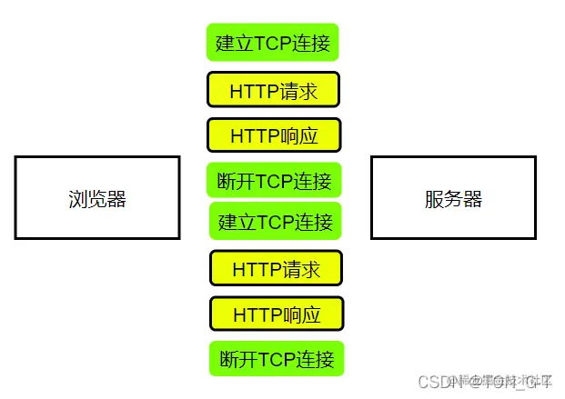
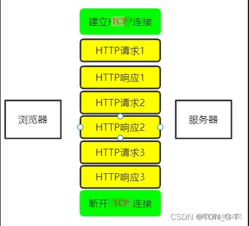
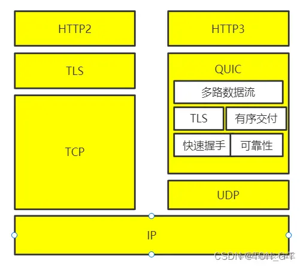

## vue的双向数据绑定

1、双向绑定实现了什么功能

实现了视图(view)和数据(data)的互相改变，即可通过改变数据改变视图，也可以通过视图的页面改变实现数据的改变

2、双向绑定是那两个方向

视图到数据的绑定，数据到视图的绑定

3、视图到数据的绑定是怎么实现的

视图到数据的绑定是通过事件的监听，类似于input标签可以监听input事件，通过v-modle指令对应的函数监听数据的变化，v-modle相当于@input和value

4、数据到视图的绑定是怎么实现的

要知道数据的变化可以通过Object.defineProperty()对属性设置一个set函数，当数据发生改变了就会来触发这个函数，我们只需要将一些需要更新的方法放在这里面就可以实现data更新view了

## v-show和v-if

控制手段不同：v-show是控制css的display是否为none来隐藏或展示，dom元素一直都是在的。而v-if显示隐藏是直接将整个dom元素添加或删除。
编译过程不同：v-show只是简单地基于css切换。而v-if的切换有一个局部编译/卸载的过程，切换过程中会销毁和重建内部的事件监听和子组件。
编译条件不同：v-if是真正的条件渲染，它会确保在切换过程中条件块内的事件监听器和子组件被销毁和重建，只有渲染条件为真时才渲染。
v-show由false变为true的时候不会触发组件的生命周期。
v-if由false变为true的时候，触发组件的beforeCreate、create、beforeMount、mounted钩子，由true变为false时触发组件的beforeDestory、destoryed方法。
v-if有更高的切换消耗，v-show有更高的初始渲染消耗。

## 重排(reflow)和重绘(repaint)

页面生成的过程：

1.HTML 被 HTML 解析器解析成 DOM 树；

2.CSS  被 CSS 解析器解析成 CSSOM 树；

3.结合 DOM 树和 CSSOM 树，生成一棵渲染树(Rende Tree)，这一过程称为 Attachment；

4.生成布局(flow)，浏览器在屏幕上“画”出渲染树中的所有节点；

5.将布局绘制(paint)在屏幕上，显示出整个页面。第四步和第五步是最耗时的部分，这两步合起来，就是我们通常所说的渲染。

渲染：

在页面的生命周期中，网页生成的时候，至少会渲染一次。在用户访问的过程中，还会不断触发重排(reflow)和重绘(repaint)，不管页面发生了重绘还是重排，都会影响性能，最可怕的是重排，会使我们付出高额的性能代价，所以我们应尽量避免。

重绘：某些元素的外观被改变，例如：元素的填充颜色
重排：重新生成布局，重新排列元素。

重绘不一定导致重排，但重排一定会导致重绘。

下面情况会发生重排：

页面初始渲染，这是开销最大的一次重排

添加/删除可见的DOM元素

改变元素位置

改变元素尺寸，比如边距、填充、边框、宽度和高度等

改变元素内容，比如文字数量，图片大小等

改变元素字体大小

改变浏览器窗口尺寸，比如resize事件发生时

激活CSS伪类（例如：:hover）

设置 style 属性的值，因为通过设置style属性改变结点样式的话，每一次设置都会触发一次reflow
查询某些属性或调用某些计算方法：offsetWidth、offsetHeight等，除此之外，当我们调用 getComputedStyle方法，或者IE里的 currentStyle 时，也会触发重排，原理是一样的，都为求一个“即时性”和“准确性”。

## SPA

SPA，即单页面应用(Single Page Application)。所谓单页 Web 应用，就是只有一张 Web 页面的应用。单页应用程序 (SPA) 是加载单个 HTML 页面并在用户与应用程序交互时动态更新该页面的 Web 应用程序。浏览器一开始会加载必需的 HTML 、 CSS 和 JavaScript ，所有的操作都在这张页面上完成，都由 JavaScript 来控制。

## 前端路由原理hash和history

对于前端路由来说， hash 和 history 都可以用于前后端分离项目

### Hash模式

hash 模式是一种把前端路由的路径用井号 # 拼接在真实 url 后面的模式。当井号 # 后面的路径发生变化时，浏览器并不会重新发起请求，而是会触发 onhashchange 事件。

### hash的特点

hash变化会触发网页跳转，即浏览器的前进和后退。

hash 可以改变 url ，但是不会触发页面重新加载（hash的改变是记录在 window.history 中），即不会刷新页面。也就是说，所有页面的跳转都是在客户端进行操作。因此，这并不算是一次 http 请求，所以这种模式不利于 SEO(搜索引擎)优化。hash 只能修改 # 后面的部分，所以只能跳转到与当前 url 同文档的 url 。

hash 通过 window.onhashchange 的方式，来监听 hash 的改变，借此实现无刷新跳转的功能。

hash 永远不会提交到 server 端（可以理解为只在前端自生自灭）。

### History模式

history API 是 H5 提供的新特性，允许开发者直接更改前端路由，即更新浏览器 URL 地址而不重新发起请求。

### history的特点

新的 url 可以是与当前 url 同源的任意 url ，也可以是与当前 url 一样的地址，但是这样会导致的一个问题是，会把重复的这一次操作记录到栈当中。
通过 history.state ，添加任意类型的数据到记录中。
可以额外设置 title 属性，以便后续使用。
通过 pushState 、 replaceState 来实现无刷新跳转的功能。

### 存在问题

使用 history 模式时，在对当前的页面进行刷新时，此时浏览器会重新发起请求。如果 nginx 没有匹配得到当前的 url ，就会出现 404 的页面。
而对于 hash 模式来说，  它虽然看着是改变了 url ，但不会被包括在 http 请求中。所以，它算是被用来指导浏览器的动作，并不影响服务器端。因此，改变 hash 并没有真正地改变 url ，所以页面路径还是之前的路径， nginx 也就不会拦截。
因此，在使用 history 模式时，需要通过服务端来允许地址可访问，如果没有设置，就很容易导致出现 404 的局面。

### 两者选择

to B 的系统推荐用 hash ，相对简单且容易使用，且因为 hash 对 url 规范不敏感；

to C 的系统，可以考虑选择 H5 history ，但是需要服务端支持；

能先用简单的，就别用复杂的，要考虑成本和收益。

### eg

hash: http://192.168.3.9:3000/#/column/x/y

访问到的实际地址http://192.168.3.9:3000

history: http://192.168.3.9:3000/column/x/y

访问到的实际地址http://192.168.3.9:3000/column/x/y

## 从输入 URL 到页面展示发生了什么

1、输入地址

2、浏览器查找域名的 IP 地址

3、浏览器向 web 服务器发送一个 HTTP 请求

4、服务器的永久重定向响应

6、服务器处理请求

7、服务器返回一个 HTTP 响应

8、浏览器显示 HTML

9、浏览器发送请求获取嵌入在 HTML 中的资源（如图片、音频、视频、CSS、JS等等）

## Cookie、sessionStorage、localStorage的区别

HTTP cookie，简称cookie，是用户浏览网站时由网络服务器创建并由用户的网页浏览器存放在用户计算机或其他设备上的小文本文件。Cookie使Web服务器能够在用户的设备上存储状态信息（如添加到在线商店购物车中的商品）或跟踪用户的浏览活动（如点击特定按钮、登录或记录历史）

共同点
都是保存在浏览器端！

区别
1）cookie数据始终在同源的http请求中携带（即使不需要），即cookie在浏览器和服务器间来回传递；存储大小限制也不同，cookie数据不能超过4k，同时因为每次http请求都会携带cookie，所以cookie只适合保存很小的数据，如会话标识。

而sessionStorage和localStorage不会自动把数据发给服务器，仅在本地保存。sessionStorage和localStorage 虽然也有存储大小的限制，但比cookie大得多，可以达到5M或更大。

2） 数据有效期不同，sessionStorage：仅在当前浏览器窗口关闭前有效，自然也就不可能持久保持；localStorage：始终有效，窗口或浏览器关闭也一直保存，因此用作持久数据；cookie只在设置的cookie过期时间之前一直有效，即使窗口或浏览器关闭。

3）作用域不同，sessionStorage不在不同的浏览器窗口中共享，即使是同一个页面；localStorage 在所有同源窗口中都是共享的；cookie也是在所有同源窗口中都是共享的。

###  问题扩展

1）session和cookie有什么区别 ？
建议答案 ： session是存储服务器端，cookie是存储在客户端，所以session的安全性比cookie高。获取session里的信息是通过存放在会话cookie里的session id获取的。而session是存放在服务器的内存中里，所以session里的数据不断增加会造成服务器的负担，所以会把很重要的信息存储在session中，而把一些次要东西存储在客户端的cookie里。
session的信息是通过sessionid获取的，而sessionid是存放在会话cookie当中的，当浏览器关闭的时候会话cookie消失，所以sessionid也就消失了，但是session的信息还存在服务器端
2）怎么给localStorage设置值，和获取值 ？
设置值：localStorage.setItem(键，值)
获取值：localStorage.getItem(键)

（4）结合项目中使用

这个用的比较多的是在注册登陆这个功能的时候

## 简单逻辑题:一串字符串找出相同字符的个数

## CSS布局:左右两边，左边200px，右边自适应怎么写

## HTTP1和HTTP2的区别

1) http1.0

每次请求都必须新建一次连接，必须通过TCP的三次握手才能开始传输数据，连接结束之后还要经历四次挥手。 不跟踪每个浏览器的历史请求

> 缺点

连接无法复用：每次请求都需要建立一个TCP连接，费时费力
队头阻塞：下一个请求必须在前一个请求响应到达后发送。如果某请求一直不到达，那么下一个请求就一直不发送。（高延迟--带来页面加载速度的降低）
每下载文件时都需要建立TCP连接、传输数据和断开连接这样的步骤，无疑会增加大量无谓的开销，因此HTTP1.1增加了持久连接的方法。

2) http1.1

在HTTP1.1中，默认支持长连接，即在一个TCP连接上可以传送多个HTTP请求和响应，减少了建立和关闭连接的消耗和延迟

支持长连接，通过Keep-Alive保持HTTP连接不断开，避免重复建立TCP连接
管道化，通过长连接实现在一个连接中传输多个文件
加入缓存处理（新字段cache-control）
支持断点续传
增加了Host字段，实现了在一台WEB服务器上可以同一个IP地址和端口号上使用不同的主机名来创建多个虚拟WEB站点
并且添加了其他请求方法：put、delete、options..

> 缺点

高延迟--队头阻塞
无状态特性--阻碍交互
（带来巨大头部）协议对于连接状态没有记忆能力。纯净的HTTP是没有cookie等机制的，每一个连接都是一个新的连接。上一次请求验证了用户名密码，而下一次请求服务器并不知道它与上一条请求有何关联
明文传输--不安全
传输内容没有加密，中途可能被篡改和劫持
不支持服务端推送

3) http2.0

HTTP2是基于SPDY，最大的一个目标是在用户和网站键只用一个连接 。

HTTP2采用一个域名只使用一个TCP长连接来传输数据，这样整个页面资源的下载过程只需一次慢启动，也避免了多个TCP连接竞争带宽。同时实现资源的并行请求，解决队头阻塞问题。

特点： 二进制传输：将请求和响应数据分为更小的帧，并且采用二进制编码
Header压缩：采用HPACK算法压缩头部，同时同一个域名下的两个请求，只会发送差异数据，减少冗余的数据传输，降低开销
多路复用：同一个域名下所有通信都是单个连接上完成，单个连接可以承载任意数量的双向数据流，数据流以消息形式发送，而消息由一个或多个帧组成，可以乱序发送
服务端推送：服务端可以新建“流”主动向客户端发送消息，提前推送客户端需要的静态资源，减少等待延迟
提高安全性：HTTP2也是明文的，只不过格式是二进制的，但HTTP2都是https协议的，跑在TSL上面。

> 问题

HTTP2仍存在问题：TCP+TLS建立连接的时间是主要瓶颈：没有从根本上解决队头阻塞问题，一旦遇到丢包，TCP协议还是会重新发送数据。我们知道在HTTP/2中，多个请求是跑在一个TCP管道中的，如果其中任意一路数据流中出现了丢包的情况，那么就会阻塞该TCP连接中的所有请求。这不同于HTTP/1.1，使用HTTP/1.1时，浏览器为每个域名开启了6个TCP连接，如果其中的1个TCP连接发生了队头阻塞，那么其他的5个连接依然可以继续传输数据。

4) http3.0

HTTP3甩掉TCP、TSL的包袱，构建高效网络QUIC协议。

HTTP3选择了UDP协议，基于UDP实现了类似TCP的多路数据流、传输可靠性等功能，将这套功能称为QUIC协议。

> 特点

基于UDP协议改造，实现了快速握手

集成了TLS的加密功能

多路复用，彻底解决了头阻塞问题（一个物理连接上可以有多个独立的逻辑数据流，实现了数据流的单独传输）

实现了类似TCP的流量控制、传输可靠性的功能

5) 总结

**HTTP1.0：**

浏览器与服务器只保持短暂的连接，浏览器每次请求都需要与服务器建立一个TCP连接

**HTTP1.1：**

引入了持久连接（TCP默认不关闭，可以被多个请求复用）

在同一个TCP连接里，客户端可以发送多个请求

多个请求按次序在服务端被处理

新增了一些请求方法、请求头和响应头

**HTTP2.0**

采用二进制格式而非文本格式

完全多路复用，只需要建立一个连接即可实现并行

使用报头压缩，降低开销

服务器推送

**HTTP3.0**

QUIC 基于 UDP 实现，是 HTTP/3 中的底层支撑协议，该协议基于 UDP，又取了 TCP 中的精华，实现了即快又可靠的协议。

**面试回答**

浏览器与服务器建立TCP连接，即三次握手(确保客户端和服务端的接收和发送都正常)，TCP连接成功，浏览器发出HTTP请求命令，服务端接收请求并返回HTTP响应，服务器关闭连接，即四次挥手，浏览器解析请求的资源，TCP连接的优点是保证了传输可靠，但是由于发送和接收都需要时间所以速度慢，而UDP只管发送，不管对端有没有收到，优点是速度快，缺点是不能保证传输可靠性，而HTTP1.0浏览器与服务器只保持短暂的连接，浏览器每次请求都需要与服务器建立一个TCP连接，在建立连接上花费太多时间，HTTP1.1引入了持久连接（TCP默认不关闭，可以被多个请求复用，在同一个TCP连接里，客户端可以发送多个请求，多个请求按次序在服务端被处理，但由于是串行连接，当顺序发送的请求序列中的一个请求因为某种原因被阻塞时，在后面排队的所有请求也一并被阻塞，会导致客户端迟迟收不到数据造成队头阻塞，而HTTP2.0实现了完全多路复用，只需要建立一个连接即可实现并行，使用报头压缩，降低开销

## 对于Http你了解什么

1) 什么是http?
   HTTP（HyperText Transfer Protocol），是超文本传输协议，是目前互联网上要用最广泛的一种网络协议，所有的 WWW文件都必须遵守该标准。HTTP又使用了可靠的数据传输协议TCP协议，不会产生数据丢失和损坏。（HTTP协议属于应用层协议）。

2) HTTP的工作流程

浏览器与服务器建立TCP连接，即三次握手(确保客户端和服务端的接收和发送都正常)

TCP连接成功，浏览器发出HTTP请求命令

服务端接收请求并返回HTTP响应

服务器关闭连接，即四次挥手

浏览器解析请求的资源

UDP只管发送，不管对端有没有收到

3) 队头阻塞

当顺序发送的请求序列中的一个请求因为某种原因被阻塞时，在后面排队的所有请求也一并被阻塞，会导致客户端迟迟收不到数据

4) 解决队头阻塞

将同一页面的资源分散到不同域名下 ，提示连接上限。Chrome，对于同一个域名允许同时建立6个TCP持久连接，使用TCP连接时，虽然能共用一个TCP管道，但在一个管道中同一时刻只能处理一个请求。
Spriting合并多张小图为一张大图，再用JavaScript或Css将小图重新分割
内联，将图片的原始数据嵌入在Css文件里面的URL里减少网络请求次数

## Get和post的使用，和区别

**最直观的区别就是GET把参数包含在URL中，POST通过request body传递参数。**

- GET在浏览器回退时是无害的，而POST会再次提交请求。

- GET产生的URL地址可以被Bookmark，而POST不可以。

- GET请求会被浏览器主动cache，而POST不会，除非手动设置。

- GET请求只能进行url编码，而POST支持多种编码方式。

- GET请求参数会被完整保留在浏览器历史记录里，而POST中的参数不会被保留。

- GET请求在URL中传送的参数是有长度限制的，而POST么有。

- 对参数的数据类型，GET只接受ASCII字符，而POST没有限制。

- GET比POST更不安全，因为参数直接暴露在URL上，所以不能用来传递敏感信息。

- GET参数通过URL传递，POST放在Request body中

**HTTP是什么？HTTP是基于TCP/IP的关于数据如何在万维网中如何通信的协议。**

HTTP的底层是TCP/IP。所以GET和POST的底层也是TCP/IP，也就是说，GET/POST都是TCP链接。

GET和POST能做的事情是一样一样的。你要给GET加上request body，给POST带上url参数，技术上是完全行的通的。

HTTP只是个行为准则，而TCP才是GET和POST怎么实现的基本。

现在你知道，GET和POST本质上就是TCP链接，并无差别。

但是由于HTTP的规定和浏览器/服务器的限制，导致他们在应用过程中体现出一些不同。

## 从url的输入到页面的过程

## Js原生链

## Vue的生命周期

## Es6的新特性

## Vue-ruter的使用，哪些比较方便？（记不清具体问题，多看看）

## 说一下你对闭包的理解（高频考点）

## js的filter函数的作用以及常见用法

## 盒子模型