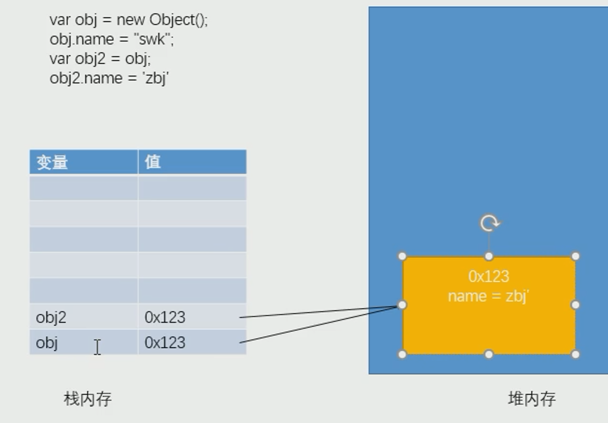
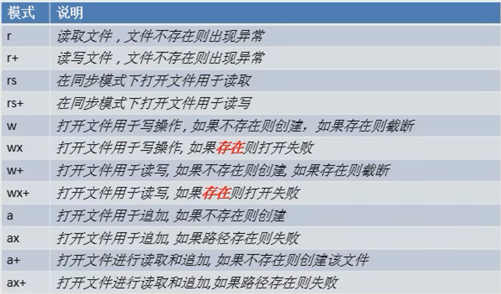

# Node.js学习笔记

## node基础模块化

```js
引入其他的模块

在node中，通过require()函数来引入外部的模块
require()可以传递一个文件的路径作为参数，node将会自动根据该路径来引入外部模块这里路径，如果使用相对路径，必须以.或..开头,为模块标识

模块化

-在Node中，一个js文件就是一个模块
-在Node中，每一个js文件中的js代码都是独立运行在一个函数中
而不是全局作用域，所以一个模块的中的变量和函数在其他模块中无法访问

模块分成两大类
  核心模块
    -由node引擎提供的模块
    -核心模块的标识就是，模块的名字

  文件模块
    -由用户自己创建的模块
    -文件模块的标识就是文件的路径（绝对路径，相对路径)
        相对路径使用.或..开头

在node中有一个全局对象global，它的作用和网页中window类
在全局中创建的变量都会作为global的属性保存
在全局中创建的函数都会作为global的方法保存

当node在执行模块中的代码时，它会首先在代码的最顶部，添加如下代码
function (exports,require, module,_filename,_ dirname) {
在代码的最底部，添加如下代码
}

```

## CommonJS规范中的exports和module.exports

### 变量存储在堆栈中的关系



new一个对象相当于在堆内存中开辟一个存储空间，在栈内存中存储的是堆内存的地址，obj2 = obj相当于他们指向同一堆内存地址，所以改变obj2的值，obj的值也会变。 若obj2 = null则obj的值不变，此时相当于更改变量。

-通过exports只能使用.的方式来向外暴露内部变量

**exports.XXX=XXXX**

-而module.exports既可以通过.的形式,也可以直接赋值

**module.exports.XXX=XXXX**

**module.exports = {}**

function _init()方法模块内私有，自己使用，只将想要导出的导出。

```js
// 可被调用
module.exports  = {
    name : "孙悟空",
    age : 18,
    sayName : function () {
        console.log('我是孙悟空')
    }
}

// 不可被调用
exports  = {
    name : "孙悟空",
    age : 18,
    sayName : function () {
        console.log('我是孙悟空')
    }
}

//调用别的模块
var moduleA = require('./a')
```

## 包简介

CommonJS的包规范由包结构和包描述文件两个部分组成。

```
包结构
包实际上就是一个压缩文件，解压以后还原为目录。符合规范的目录，应该包含如下文件∶
- package.json   描述文件（重要）
- bin---可执行二进制文件
- lib ---js代码
- doc---文档
- test---单元测试


包描述文件
-描述包的相关信息，以供外部读取分析
```

## ES模块化写法

方法1:

```js
1.import moduleA from './module/moduleA.js'
通过import引入其他文件,不使用require
注意:必须是引入完整路径的js文件

2.export default moduleA向外暴露方法

3.在package.json中添加"type": "module",即可正常运行js

```

方法二:

```js
1.import {moduleB} from './module/moduleB.js'
通过import引入其他文件的一个模块
注意:必须是引入完整路径的js文件

2.export  moduleB向外暴露对象

3.在package.json中添加"type": "module",即可正常运行js
```

>CommonJS和ES两种规范不可以混用

## NPM命令

如何使用npm下载

1.npm init(创建一个包管理文件,package.json)
2.输入包的信息
3.npm i 包名 ,在当前目录安装包
4.利用package中的信息npm i 就可以下载所需要的包

```
npm -v
-查看版本· 

npm
-帮助说明

npm search包名
-搜索模块包

npm install 包名
npm i 包名
-在当前目录安装包

npm install包名-g
一全局模式安装包（一般都是一些工具）

npm remove/r 包名
删除包

npm install 包名 --save 安装包并添加到依赖中（一般都用这个）

通过npm下载的包都放到node modules文件夹中我们通过npm下载的包，直接通过包名引入即可

npm list 列出当前安装的包目录

npm info 查看包信息

```

### nrm全局安装方式

## node包查找

node在使用模块名字来引入模块时，它会首先在当前目录的node modules中寻找是否含有该模块，如果有则直接使用，如果没有则去上一级目录的node_modules中寻找，
如果有则直接使用，如果没有则再去上一级目录寻找，直到找到为止直到找到磁盘的根目录，如果依然没有，则报错

## Buffer缓冲区

从结构上看Buffer非常像一个数组， 它的元素为16进制的两位数。实际上一个元素就表示内存中的一个字节。
实际上Buffer中的内存不是通过JavaScript分配的，而是在底层通过C++申请的。也就是我们可以直接通过Buffer来创建内
中的空间。

使用buffer不需要引入模块直接引用即可
在buffer中存储的都是二进制数据，但是在显示时都是以16进制的形式显示
buffer中每一个元素的范围是从00 - ff0 -255o0000000 - 11111111
计算机一个0或一个1我们称为1位(bit)
8bit = 1byte(字节)
buffer中的一个元素，占用内存的一个字节

buffer是直接对底层内存进行操作，所以大小一旦创建就不可修改，是一段连续的空间

只要数字输出在控制台，一定是10进制
Buffer.allocUnsafe (size)创建一个指定大小的buffer，但是buffer中可能含有敏感数据,不清空原来内存的数据

```js
//创建一个指定大小的buffer(类方法)
var buf2 = Buffer.alloc(10)
```

## fs (文件系统)

·在Node中，与文件系统的交互是非常重要的，服务器的本质就将本地的文件发送给远程的客户端

. Node通过fs模块来和文件系统进行交互

·该模块提供了一些标准文件访问API来打开、读取、写入文件，以及与其交互。

·要使用fs模块，首先需要对其进行加载
-const fs = require("fs");

文件系统(File system)
-文件系统简单来说就是通过Node来操作系统中的文件
-使用文件系统，需要先引入fs模块，fs是核心模块，直接引入不需要下载

### 同步文件的写入
```js

-手动操作的步骤
1.打开文件
    fs.opensync(path, flags [ , mode])I
    - path要打开文件的路径
    - flags打开文件要做的操作的类型
      r只读的
      w可写的
      -mode设置文件的操作权限，一般不传
      返回值:
        -该方法会返回一个文件的描述符作为结果，我们可以通过该描述符来对文件进行各种操作

2.向文件中写入内容
同步：
    fs.writesync(fd, string[ , position [ , encoding]]
    - fd文件的描述符，需要传递要写入的文件的描述符
    - string要写入的内容
    - position 写入的起始位置
    - encoding写入的编码，默认utf-8，一般也不用写
异步文件写入
    fs.open (path, flags[ , mode] , callback)
    -用来打开一个文件
    -异步调用的方法，结果都是通过回调函数的参数返回的
    -回调函数两个参数:
        err错误对象，如果没有错误则为null
        fd文件的描述符

//一般使用异步方式，回调函数对错误进行截止，使错误只留在这个函数内

3.保存并关闭文件
    fs.closesync ( fd)
    - fd要关闭的文件的描述符

```

### 简单文件写入

```js

    fs.writeFile(file, data[ , options] , callback)fs.writeFilesync (file, data[ , options] )
    - file要操作的文件的路径
    - data要写入的数据
    - options选项，可以对写入进行一些设置
    - callback当写入完成以后执行的函数
    -flag
        r 只读
        w 可写
        a 追加

```

打开状态：flag = 



### 流式文件写入

```js

创建一个可写流
fs.createwritestream (path[ , options] )
    -可以用来创建一个可写流
    - path,文件路径
    - options配置的参数

```

### 文件的读取

```
1.同步文件读取

2.异步文件读取

3.简单文件读取
    fs.readFile (path[ , options] , callback)fs.readilesync(path[ , options])
    - path要读取的文件的路径
    - options读取的选项
    - callback回调函数，通过回调函数将读取到内容返回(err,data)
        err错误对象
        data读取到的数据，会返回一个Buffer

4.流式文件读取

//监听流的开启和关闭
rs.once("open",function (){
    console.log("可读流打开")
})
rs.once("close",function (){
    console.log("可读流关闭")
//    数据读写完毕，关闭可写流
    ws.end()
})

ws.once("open",function (){
    console.log("可写流打开了")
})
ws.once("close",function (){
    console.log("可写流关闭了")
})

//如果需要读取一个可读流中的数据，必须要为可读流绑定一个data事件，data事件绑定完毕，它会自动开始读取数据
rs.on("data",function (data){
    console.log(data.length);
})

上面的代码可以用pipe代替
//pipe可以将可读流中的文件直接传输进可写流中
rs.pipe(ws)
```

### 文件的一些其他操作

**验证路径是否存在**

```js
    -fs.exists(path , callback)
    - fs.existsSync(path)
```

**获取文件信息**

```js 
- fs.stat(path, callback)
- fs.statSync(path)
```
**删除文件**

```js
- fs.unlink(path, callback)
- fs.unlinkSync(path)
  ```

**列出文件**

```js  
- fs.readdir(path[, options], callback)
- fs.readdirSync(path[, options])

fs.readdir(".",function (err,files){
    if (!err){
        console.log(files);
    }
})
```

  - 读取一个目录的目录结构
  - files是一个字符串数组，每一个元素就是一个文件夹或文件的名字

**截断文件**
  
```js  
- fs.truncate(path, len, callback)
- fs.truncateSync(path, len)
```

-截断文件，将文件修改为指定大小

**建立目录**

```js 
 - fs.mkdir(path[, mode], callback)
 - fs.mkdirSync(path[, mode])
```

**删除目录**

```js
- fs.rmdir(path, callback)
- fs.rmdirSync(pan) 
```

**重命名文件和目录**

```js
- fs.rename(oldPath, newPath, callback)
- fs.renameSync(oldPath, newPath)
```

也可实现剪切功能

**监视文件更改写入**

```js
- fs.watchFile(filename[, options], listener)
-监视文件的修改
-参数:
filename 要监视的文件的名字
options 配置选项
    通过参数设置可改变监听时间，{interval:1000}
listener回调函数，当文件发生变化时，回调函数会执行
    在回调函数中会有两个参数:
        curr 当前文件的状态
        prev 修改前文件的状态
            -这两个对象都是stat对象
        


```
