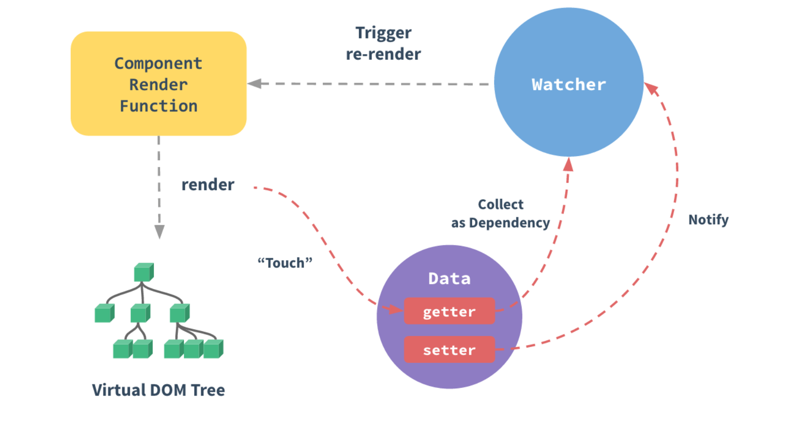
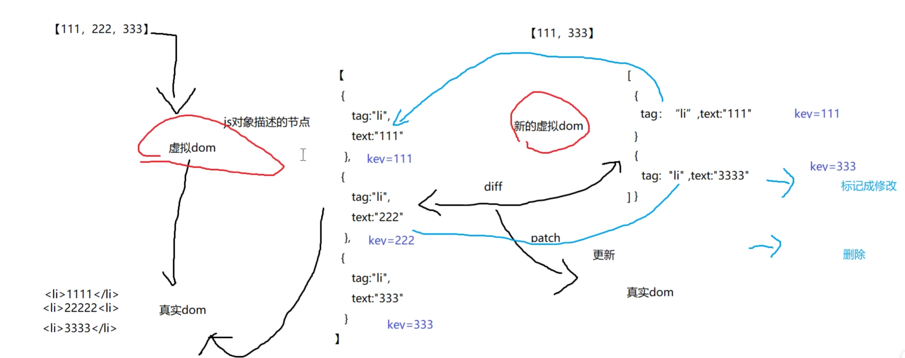

# Vue2.0

## 引入Vue

## Vue拦截原理

当你把一个普通的 JavaScript 对象传入 Vue 实例作为 data 选项，Vue 将遍历此对象所有的 property，并使用 Object.defineProperty 把这些 property 全部转为 getter/setter。Object.defineProperty 是 ES5 中一个无法 shim 的特性，这也就是 Vue 不支持 IE8 以及更低版本浏览器的原因。

这些 getter/setter 对用户来说是不可见的，但是在内部它们让 Vue 能够追踪依赖，在 property 被访问和修改时通知变更。这里需要注意的是不同浏览器在控制台打印数据对象时对 getter/setter 的格式化并不同，所以建议安装 vue-devtools 来获取对检查数据更加友好的用户界面



### Vue的底层原理

每次数据更改的时候，通过set拦截，通知watcher,watcher收录当前状态再页面中所有用到的地方，对所有相关联的组件代码进行更新，而在更新过程中它们会先创建一份新的虚拟DOM对比老的虚拟DOM节点，在对比过程中找出最小的代价的方法来更新虚拟DOM到真实的DOM中。

## Vue模板语法

```js
var vm = new Vue({
        el: "#box",
        data: {
            myname: "Liangxuan",
            myage: 100
        },
        //方法
        methods: {
            handleChange() {
                console.log("handleChange")
                vm.myname = "teichui"
                vm.myage = 18
            }
        //    不操作DOM的情况下改变页面显示
        }
    })
```

可用this替代全局变量vm,this为该对象实例

## 列表渲染

(1)v-for(特殊v-for="n in 10")

a. in

b. of

没有区别

(2)key:

*跟踪每个节点的身份，从而重用和重新排序现有元素

*理想的key值是每项都有的且唯一的id。data.id

虚拟DOM:js对象描述的节点

真实DOM：真实的li标签等



>当节点更新，即数组中元素发生改变时产生新的虚拟DOM，新的虚拟DOM与原有的虚拟DOM做对比然后更新真实DOM，即每次创建先更新虚拟DOM，产生一个小的补丁，再更新真实DOM，若直接创建一个真实的DOM则会非常浪费时间和资源

(3)数组更新检测

a.使用以下方法操作数组，可以检测变动

push() pop() shift() unshift() splice() sort() reverse()

b. filter(), concat()和slice() ,map(),新数组替换旧数组，只有通过原数组等于新数组的赋值方法才能使原数组的值发生改变

c.不能检测以下变动的数组

vm.items[indexOfltem] = newValue

*解决*(1)Vue.set(example1.items, indexOfltem, newValue)

eg:Vue.set(vm.datalist,0,"xiaohong")

(2)splice

vm.datalist.splice(0,1,"xiaoming")表示删除从第0个元素开始的第一个元素，并添加"xiaoming"

(4)应用:显示过滤结果


# Vue3.0

## 数组的更新检测

vm.items[indexOfltem] = newValue可以直接被拦截

## 解决ajax跨域请求问题

1. 删除发送数据的请求开头网址 

```js
 mounted() {
    axios.get('/ajax/moreComingList?token=&movieIds=1479130,1298151,1308442,1203426,1425908,1218073,1336437,248949,1435030,1364066&optimus_uuid=EA12C040BC0111ED8382EBCFDAF31B6680301CCDFA724824A9253933EF5465A4&optimus_risk_level=71&optimus_code=10').then(res => {
      console.log(res.data)
    })
  }
  ```

  2. 在vue.config中,当有/ajax出现时，自动请求https://i.maoyan.com

  ```js
  // 配置反向代理
  devServer: {
    proxy: {
      "/ajax": {
        target: "https://i.maoyan.com",
        changeOrigin: true
      }
    }
  }
  ```

  3. 当都请求同一个开头的请求时，可以在前面加上自定义字符串，通过在vue.config中的pathRewrite重写成"^/kerwin":''，即可变回原网址

  ```js
 mounted() {
    axios.get('kerwin/ajax/moreComingList?token=&movieIds=1479130,1298151,1308442,1203426,1425908,1218073,1336437,248949,1435030,1364066&optimus_uuid=EA12C040BC0111ED8382EBCFDAF31B6680301CCDFA724824A9253933EF5465A4&optimus_risk_level=71&optimus_code=10').then(res => {
      console.log(res.data)
    })
  }
  ```

  ```js
  devServer: {
    proxy: {
      // "/ajax": {
      //   target: "https://i.maoyan.com",
      //   changeOrigin: true
      // }

      "/kerwin":{
        target:"https://i.maoyan.com",
        changeOrigin: true,
        pathRewrite:{
          "^/kerwin":''
        }
      }
    }
  }
  ```

  4. 重启服务器，报错消失，拿到跨域数据

  总结：服务器与服务器之间可以通信，本地的文件也可以与本地服务器通信

  @ 别名===> src的绝对路径

  ## vue router配置映射表

  地址与组件之间一一映射

### rounter具体配置过程

1. 找到router文件夹下的index.js,引入所需要的组件

```js
import Vue from 'vue'
import VueRouter from 'vue-router'
import Films from "@/views/Films";
import Cinemas from "@/views/Cinemas";
import Center from "@/views/Center";
```
2. 注册路由插件

```js
Vue.use(VueRouter)  // 注册路由插件，两个全局 router-view router-link
```

3. 

```js
// 配置表
const routes = [
  {
    path: '/films',
    component: Films
  },
  {
    path: '/cinemas',
    component: Cinemas
  },
  {
    path: '/center',
    component: Center
  }
]
```

4. 在app.vue中插入路由容器

```js
<!--  路由容器  -->
    <router-view></router-view>
```