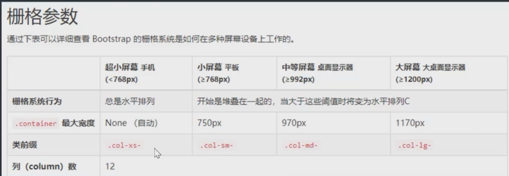

# BootStrap

### BootStap安装

第一种方式:

直接引入文件的方式（用CDN的地址

CSS: "https://cdn.jsdelivr.net/npm/bootstrap@3.3.7/dist/css/bootstrap.min.css"
JS:
https://cdn.jsdelivr.net/npm/jquery@3.4.1/dist/jquery.slim.min.js"
https://cdn.jsdelivr.net/npm/bootstrap@3.3.7/dist/js/bootstrap.min.js"

第二种方式:
模块化的包管理的方式npm install bootstrap

**模板**

```html
<!DOCTYPE html>
<html lang="en">
<head>
    <meta charset="UTF-8">
    <title>Title</title>
  <!-- 最新版本的 Bootstrap 核心 CSS 文件 -->
  <link rel="stylesheet" href="https://stackpath.bootstrapcdn.com/bootstrap/3.4.1/css/bootstrap.min.css" integrity="sha384-HSMxcRTRxnN+Bdg0JdbxYKrThecOKuH5zCYotlSAcp1+c8xmyTe9GYg1l9a69psu" crossorigin="anonymous">
</head>
<body>

</body>
</html>
<!-- 引入jQuery文件 -->
<script src="https://cdn.jsdelivr.net/npm/jquery@3.4.1/dist/jquery.slim.min.js" integrity="sha256-pasqAKBDmFT4eHoN2ndd6lN370kFiGUFyTiUHWhU7k8=" crossorigin="anonymous"></script>
<!-- 最新的 Bootstrap 核心 JavaScript 文件 -->
<script src="https://stackpath.bootstrapcdn.com/bootstrap/3.4.1/js/bootstrap.min.js" integrity="sha384-aJ21OjlMXNL5UyIl/XNwTMqvzeRMZH2w8c5cRVpzpU8Y5bApTppSuUkhZXN0VxHd" crossorigin="anonymous"></script>
```

### 布局

口布局容器

Bootstrap需要为页面内容和栅格系统包裹一个.container容器。框架中提供了两个类。

**.container类**   用于固定宽度并支持响应式布局的容器
```html
<div class="container">
…
</div>
```
**.container-fluid类**  用于100%宽度，占据全部视口(viewport)的容器。

```html
<div class="container-fluid">
</div>
```

### 栅格使用

```html
<div class="container">
<div class="row">
    <div class="col-md-8">8</div>

    <div class="col-md-4">4</div>

</div>
<div>
```

row为一行，col一列，8占一行中的8格，一行栅格被分为8份

#### 栅格参数



### 表格属性

table ------基本表格

table-striped------条纹表格

table-bordered------加上边框

### 表单

单独的表单控件会被自动赋予一些全局样式。

所有设置了.form-control类的\<input>
\<textarea>和\<select>元素都将被默认设置宽度属性为width: 100%;。将label元素和前面提到的控件包裹在.form--group

**内联表单**

为 <form> 元素添加 .form-inline 类可使其内容左对齐并且表现为 inline-block 级别的控件。只适用于视口（viewport）至少在 768px 宽度时（视口宽度再小的话就会使表单折叠）。

**水平排列的表单**

通过为表单添加 .form-horizontal 类，并联合使用 Bootstrap 预置的栅格类，可以将 label 标签和控件组水平并排布局。这样做将改变 .form-group 的行为，使其表现为栅格系统中的行（row），因此就无需再额外添加 .row 了。

### 按钮

可作为按钮使用的标签或元素
为 \<a>、\<button> 或 \<input> 元素添加按钮类（button class）即可使用 Bootstrap 提供的样式。

可设置大小、颜色等

### 组件

不要和其他组件混合使用

图标类不能和其它组件直接联合使用。它们不能在同一个元素上与其他类共同存在。应该创建一个嵌套的 <span> 标签，并将图标类应用到这个 <span> 标签上。

只对内容为空的元素起作用
图标类只能应用在不包含任何文本内容或子元素的元素上。

下拉菜单
用于显示链接列表的可切换、有上下文的菜单。下拉菜单的 JavaScript 插件让它具有了交互性。
将下拉菜单触发器和下拉菜单都包裹在 .dropdown 里，或者另一个声明了 position: relative; 的元素。然后加入组成菜单的 HTML 代码。