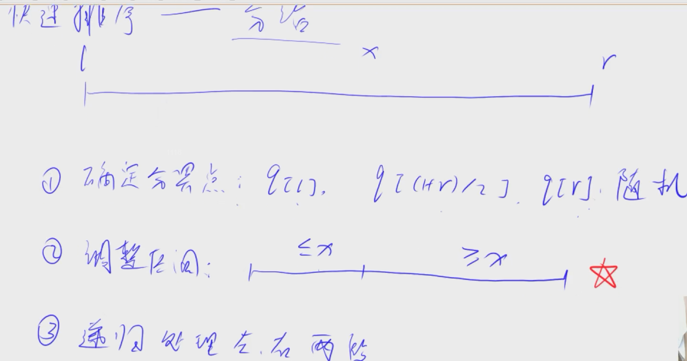

### 快速排序

1. 确定分解点

2. 调整区间（最难）

3. 递归处理左右两端

时间复杂度： nlogn(平均)

### 归并排序

1. 确定分界点（eg: mid = (l+r)/2）

2. 先递归两边

3. 归并合二为一（难点）

双指针算法

两段排好序后，两段从最小的值开始比较，若比到某段的尽头还是小于另一段，则另一段剩下的则是排序好的较大值，直接接到最后即可。

时间复杂度： nlogn（一定是）

> 稳定： 归并排序是稳定的，原序列在排完序后位置不发生变化。